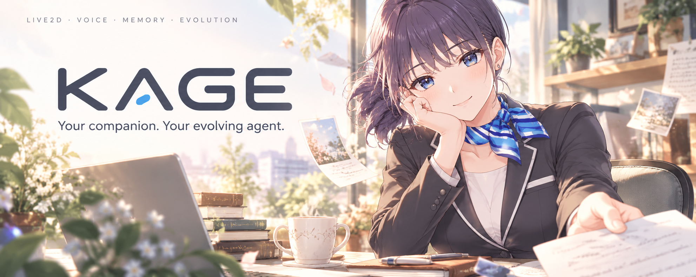
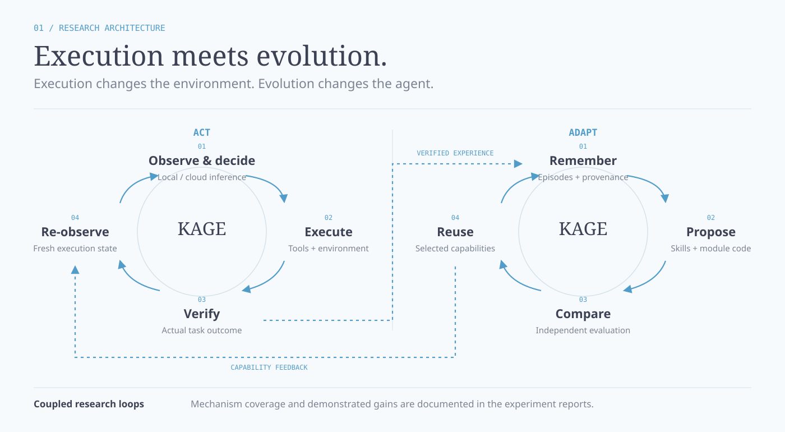
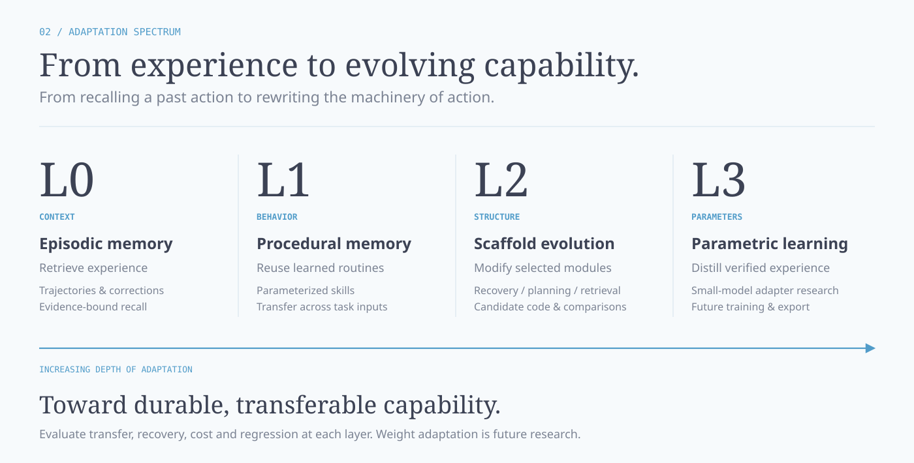

<p align="center"><a href="readme.md">English</a> · <strong>简体中文</strong></p>

<p align="center">
  <strong>迈向可自进化的通用电脑 Agent</strong><br>
  电脑操作 · 持续学习 · 程序性记忆 · Agent 自修改
</p>

<p align="center">
  <a href="#迈向可自进化的个人-agent">项目愿景</a> ·
  <a href="#研究方向">研究方向</a> ·
  <a href="#体验浏览器教学流程">开始体验</a> ·
  <a href="docs/agent-memory-evolution-master-plan-2026-09-29.md">路线图</a> ·
  <a href="docs/experiments/README.md">实验记录</a> ·
  <a href="docs/project-guide.zh-CN.md">完整指南</a>
</p>

## 迈向可自进化的个人 Agent

<strong>Kage 探索能够操作电脑、从经验与教学中学习，并改进自身决策系统部分机制的 Agent。</strong>

项目的野心是跨浏览器、文件、文档和原生应用的通用电脑操作。经验应当积累为可迁移的能力，失败任务应当为下一次学习或修改提供依据。Kage 将<strong>电脑操作执行、持续适应与 Agent 脚手架演化</strong>连接到同一个实验系统中。

### 超越固定工具集合

研究路线从检索有用记忆，延伸到创建可执行技能、修改部分 Agent 模块，再到未来将经过验证的经验蒸馏进本地模型。每一层都面向更深的能力变化，改善 Agent 求解后续任务的方式。

### 以经验驱动改进

任务失败时，可以由人类或云端教师示范解法。目标学习链保留实际动作与验证结果，提取可复用知识，再用新任务检验收益。技能、源码修改与未来的权重更新作为不同机制分别评估。

### 在个人硬件上开展前沿实验

本地小模型与按需云端教学，为有限硬件上的自主性、迁移、自修改和资源消耗研究提供实际环境。长期目标是让 Agent 能够<strong>行动、学习，并重新设计自身部分问题求解机制</strong>。

## 研究方向

### 电脑操作与程序性记忆

- <strong>通用行动能力：</strong>连接浏览器 DOM 感知、原生 macOS 辅助功能接口与未来的视觉定位。在内容、布局和初始状态变化后，评估任务完成与恢复能力。
- <strong>将经验变成能力：</strong>把轨迹与纠正转化为参数化流程，检验发现、组合与新输入迁移，而不只重放原始示范。

### 自修改与失败驱动的改进

- <strong>演化 Agent 脚手架：</strong>在隔离环境中生成候选修改，加载实际修改后的代码，对比父版本与子版本行为。恢复模块试点已实现，更广泛的模块演化是下一方向。
- <strong>选择改进路径：</strong>研究何时检索记忆、修复技能、修改模块或请求教学。失败驱动的路由仍是计划实验，将在明确预算下与固定策略比较。

### 有限硬件上的持续学习

- <strong>本地与云端协作：</strong>本地小模型承担低成本执行，云端教师按需支持困难任务与候选生成。任务成功和外部帮助成本分别记录。
- <strong>从教师经验学习：</strong>先积累经过验证且多样的轨迹，再蒸馏到本地适配器或权重；将记忆、技能与未来的参数学习作为不同机制比较。

开发从一台<strong>16 GB 内存的 Apple Silicon Mac</strong>出发。目标是在有限资源下实现实际的能力增长，并为每一步保留可复现的实验证据。

## Kage 如何成长

### 执行与演化，两个时间尺度



<strong>行动 → 验证 → 记忆 → 学习 → 评估 → 复用</strong>

执行闭环观察环境、选择动作，并检查结果状态。演化闭环使用这些证据提出技能或模块修改，比较行为，并选择有用能力供后续复用。

存在可靠检查器时，验证与实际结果绑定，例如回读浏览器任务保存的数据。候选版本与来源信息将每项改进连接到对应经验及评估记录。

### 四层适应机制



| 层级 | 改变什么 | 预期作用 |
| :--- | :--- | :--- |
| L0 · 情景记忆 | 当前任务检索到的经验 | 从过往尝试中获得相关上下文 |
| L1 · 程序性记忆 | 可调用的执行技能 | 复用并迁移经过验证的流程 |
| L2 · 脚手架演化 | 部分规划、检索或恢复模块 | 改善求解与错误恢复方式 |
| L3 · 参数学习 | 未来的本地模型适配器或权重 | 蒸馏经过验证的教师经验 |

研究目标是实现<strong>持久、可迁移的能力增长</strong>，同时衡量任务成功、能力回退、延迟、token 与学习成本。参数学习仍是未来阶段。

## 当前实验基础

| 组件 | 已实现基础 | 下一步验证 |
| :--- | :--- | :--- |
| Agent 运行时 | 多步模型／工具闭环、本地／云端路由与取消 | 更广泛任务族中的可靠性 |
| 浏览器教学 | 录制、纠正、候选提取与新页面重放 | 真实人类验收与更广泛工作流 |
| 经验与技能 | 证据绑定的经验片段、候选版本与技能执行 | 自动采用及可测量的迁移收益 |
| 模块演化 | 候选代码加载与恢复模块比较 | 更多模块与改进策略 |

最新浏览器教学阶段通过<strong>992 项工程测试</strong>，完成<strong>两次验证捕获与两次新输入重放</strong>。本地 4B 模型完成两个试点任务，但<strong>没有调用新技能</strong>：工作流复用已通，自动采用与学习收益仍未证实。

[浏览器教学报告](docs/experiments/2026-10-07-browser-demonstration.md) · [技能迁移比较](docs/experiments/2026-10-01-c4-transfer-ablation.md) · [自修改试点](docs/experiments/2026-10-01-e3-recovery-self-modification.md)

### 个人助手交互界面

Kage 通过二次元 macOS 助手呈现这套系统，支持 Live2D 表情、可选语音和可配置人格，为人与 Agent 的交互提供更有个人感的入口。以 Haru 为参考的封面是临时概念插画，未来角色可沿用这套[视觉风格](docs/assets/readme/VISUAL_STYLE.md)。

## 体验浏览器教学流程

示范任务、提取候选工作流，再用新输入重放。录制与直接重放<strong>不需要模型服务器或云端密钥</strong>。

<strong>环境要求：</strong>Apple Silicon macOS · Python 3.10+ · Node.js 18+ · Playwright Chromium。

<details>
<summary><strong>安装与启动</strong></summary>

<strong>1. 下载仓库并安装依赖。</strong>

```sh
git clone https://github.com/lemon5227/Kage.git
cd Kage
python3 -m venv .venv
source .venv/bin/activate
python -m pip install -r requirements.txt -r requirements-computer-use.txt
python -m playwright install chromium
```

<strong>2. 启动控制 API。</strong>

```sh
KAGE_MODE=control KAGE_BROWSER_PYTHON="$PWD/.venv/bin/python" \
  python -m uvicorn core.server:app --host 127.0.0.1 --port 12345
```

<strong>3. 另开终端，从仓库根目录启动 Launcher。</strong>

```sh
cd kage-avatar
npm install
npm run dev
```

打开 [Launcher](http://localhost:1420/launcher.html)，找到<strong>浏览器教学</strong>面板。

选择任务 → 启动专用浏览器 → 示范并保存 → 结束并验证 → 修改参数，在新页面重放。

完整桌面／语音启动、可选音频依赖、模型配置与教学证据路径见[配置指南](docs/project-guide.zh-CN.md#体验浏览器教学流程)。

</details>

<details>
<summary><strong>本地模型与云端配置</strong></summary>

配置文件：`~/.kage/config.json`。

| 配置项 | 用途 |
| :--- | :--- |
| `model.local_runtime` | 兼容的本地服务器与模型 |
| `model.cloud_api` | 云端服务配置 |
| `model.hybrid` | 可选路由 |

已验证的本地配置使用<strong>Agents-A1-4B Q4_K_M 与 llama.cpp</strong>；云端教学实验使用过<strong>DeepSeek</strong>。API 凭据放在仓库之外。

详见[配置说明](docs/project-guide.zh-CN.md#模型与云端配置)。云端回退与经过验证的学习是不同机制。

</details>

## 后续路线

1. <strong>扩展行动环境。</strong>完成真实人类浏览器教学验收，扩展原生 macOS 辅助功能操作，增加配备独立检查的跨应用任务。
2. <strong>让经验可靠复用。</strong>改进记忆选择、技能发现、候选谱系与迁移评估；扩展可演化模块和失败驱动的路由。
3. <strong>将经过验证的学习带入本地模型。</strong>积累多样教师轨迹，再针对实测瓶颈评估小模型蒸馏、视觉定位与推理引擎。

[完整 E／C 任务队列](docs/plans/task-queue-2026-10-01.md) · [研究路线图](docs/agent-memory-evolution-master-plan-2026-09-29.md) · [执行交接](docs/plans/execution-handoff-2026-10-03.md)

## 深入了解

| 入口 | 内容 |
| :--- | :--- |
| [完整项目指南](docs/project-guide.zh-CN.md) | 详细研究背景、安装配置与实现边界 |
| [实验档案](docs/experiments/README.md) | 方法、结果、失败与复现证据 |
| [视觉风格说明](docs/assets/readme/VISUAL_STYLE.md) | 陪伴插画方向与后续人物更换 |
| [问题与建议](https://github.com/lemon5227/Kage/issues) | 反馈、提案与协作 |

---

MIT 许可证 · [优化历史](docs/optimization_history.md)
