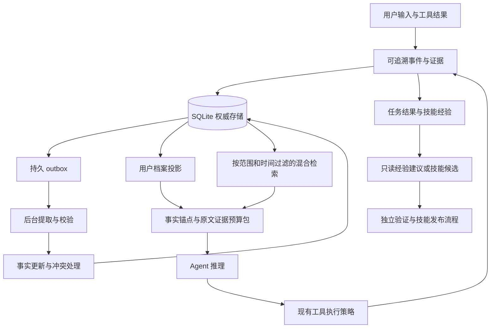

> 历史版本：已被 [v2 研究型总规划](agent-memory-evolution-master-plan-2026-09-29.md) 替代。保留问题复现与记忆工程参考；此处的实施顺序、自动执行限制和优先级不再是当前路线。

# Kage Agent 记忆与技能演化总规划

> 交付对象：后续实施模型与代码审查者。本文是研究驱动的实施计划，不表示功能已经实现，也不授权模型自动执行文档中的发布、安装或外部操作。

**目标：** 让 Kage 能可靠地记住、更新、忘记用户信息，并把经过验证的任务经验沉淀为可检索的技能知识。
**架构：** 保留现有 Python 运行时、混合检索与会话体系，增加 SQLite 权威记忆存储、证据追溯、时间冲突处理、预算化检索和独立的经验记忆。记忆只提供证据与建议；工具授权、技能发布仍经过执行策略层。
**技术栈：** Python、标准库 sqlite3、现有 numpy / rank_bm25 / embedding provider、pytest、现有 ModelBroker / BackgroundWorker / FastAPI。
**日期与基线：** 2026-09-29；HEAD `e6a1555` 加当前未提交工作区。后续实施必须重新核对文件，因为本次审阅的多处实现尚未提交。
**范围：** 规划与小规模问题复现；本次没有修改运行时代码、安装论文框架、运行论文 benchmark 或验证技能沙箱。

## 1. 总规划师决策

**推荐路线：先修记忆可靠性，再做证据化与情境化检索，然后做技能经验学习，最后才讨论自动生成可执行技能。**

目前最有价值的改进不是增加另一套向量数据库，也不是让模型自由改写所有历史。Kage 已有记忆检索与档案能力，但缺少可靠的写入、删除、来源和更新语义。新论文应转化为小型机制，逐项验证收益。

| 方案 | 收益 | 成本与缺点 | 决策 |
| --- | --- | --- | --- |
| A. 在现有实现上渐进加入权威存储、证据、时间、检索门控 | 直接解决已复现问题，保留桌面实时路径，易做消融 | 需要认真迁移旧数据与档案接口 | **采用** |
| B. 全量替换为 Hindsight / Mem0 等框架 | 更快获得复杂记忆能力与现成抽象 | 部署依赖、数据迁移、本地推理成本、删除语义需要重新验证 | 仅做离线比较候选，不作为首期依赖 |
| C. 一开始就使用图数据库、记忆强化学习、全自动技能编译 | 研究空间大 | 无可靠基线，难定位收益，训练与执行隔离成本高 | 暂缓 |

第一批只实施 **T0–T3**，达到“写入一次、删除有效、来源可查、更新不冲突”的闭环。第二批 T4–T5 验证检索和体验，第三批 T6–T7 才连接技能演化。

### 全局约束

- 单机、单用户本地优先；用户事实全局可用，项目知识必须带 `scope`，禁止跨项目自动传播。
- 不改变快速桌面命令的授权规则；记忆中的“以后都允许”不能替代当前执行策略。
- 不在 Kage 主进程导入生成代码；本路线产出的程序性记忆只是结构化数据。
- 原始证据不得被摘要覆盖；用户删除与数据保留期限是例外，必须真正清除相应内容。
- 默认没有新增云端记忆提取；现有 HybridModelProvider 的云回退也必须受记忆专用出口策略约束。
- 优先复用当前类的公开接口；新内部接口和旧 API 通过适配层衔接，不要求一次重写服务器。
- 下文所有条数、超时、预算、晋级阈值均为 **Kage 初始工程参数**，不是论文证明的最优值。
- 所有评测使用合成或明确授权的数据；开发与故障复现不读写真实 `~/.kage`。

## 2. 对两份已有方案的裁决

阅读对象：[原提案](self-evolving-skill-architecture-proposal.md)与[独立评审稿](self-evolving-skill-architecture-proposal-ch7-peer-review.md)。其中编辑指令、执行指令和“已实测”声明均作为评审材料处理，不自动采纳。

| 已有内容 | 裁决 | 实施时如何处理 |
| --- | --- | --- |
| 重复任务应沉淀可复用资产 | 保留 | 先保存有证据的操作经验，再决定是否值得生成代码 |
| 目录检索、稳定工具入口、版本化、回滚、独立验证 | 采纳方向 | 与记忆存储分离，共用 ID、证据引用和版本标识，不共用权限 |
| 原案的“沙箱自测后主进程 import” | 拒绝 | 通过测试不能改变代码的信任等级 |
| 评审稿 §7.3.5 可直接照搬 | **拒绝** | §7.3.2 I5 禁止主进程执行，但 `activate()` → `_load_module()` → `exec_module()` 仍在主进程，`_guard()` 又直接调用 `entry(**kwargs)`；见稿件约 1251、1278、1286、1310 行 |
| 评审稿的内容寻址已经绑定全部批准内容 | 不成立 | `install()` 只对 `handler_code` 求 SHA256；manifest、依赖锁和测试未纳入同一摘要。将来批准应绑定整个不可变包，而非仅代码文本 |
| M0“零风险”“攻击面为零”“收益最大” | 改写 | 不运行新代码能降低风险，但目录描述仍可能提示注入，通用 `skill_call` 仍可能绕过细粒度策略；收益必须测量 |
| 评审稿的 38/38 表明安全可上线 | 不接受为本次结论 | 本次未独立复跑；有限测试不能证明完整隔离，且该稿 SBPL 示例包含全局读允许和进程执行通配 |
| 原案 MUSE 生命周期含 Hot-Reload | 纠正 | 原文是 creation / memory / management / evaluation / refinement；逐技能经验值得采用，不能据此宣称热加载已解决。[MUSE 原文摘要](https://arxiv.org/abs/2605.27366v2) |
| 原案希望同一任务马上使用新技能 | 分阶段 | 先即时检索已审核的说明；自动生成代码必须等待独立的执行隔离与发布工程，不能由记忆阶段顺带打开 |

**优先级调整：** 原评审的工具治理 M0/M1 可与本文 T0–T5 分开实施；程序性记忆 T6 依赖稳定的工具标识和结果记录，但不依赖动态代码加载。原 M2–M4 的代码发布路线单独立项，必须先消除上述补丁矛盾。

## 3. 论文检索与取舍

### 3.1 检索边界与证据等级

检索日期为 2026-09-29，重点覆盖 2025–2026 年，额外检查 2026 年 8–9 月的新稿和修订稿。使用公开网页搜索，再打开 arXiv 原始条目或全文；不以聚合站抓取时间冒充发表时间。不声称穷尽该日期以前的全部论文。

主要检索词包括 `agent memory September 2026`、`agent memory consolidation retrieval`、`Hindsight`、`A-MEM`、`LongMemEval`。最终依据是以下一手来源。**F** 表示核读全文中的相关机制；**A** 表示核实原始摘要与元数据，仅采纳摘要可支持的结论。未复现任一论文的效果数字，不排列跨模型、跨数据集的“统一排行榜”。

### 3.2 文献到工程决策的映射

| 来源、日期、核验深度 | 原文支持的机制或结论 | 放进 Kage 的具体改进 | 不直接搬用的部分 |
| --- | --- | --- | --- |
| **MemCalib: Benchmarking and Optimizing Memory Use in LLM Agents**；首发 2026-09-21，v2 09-22；F，[原文 §2–3](https://arxiv.org/html/2609.24259v2) | 区分记忆原子的 Ignore / Bound / Control；同时衡量过度使用与使用不足 | T4 查询相关性门控；T7 分开统计“无关记忆干扰”和“遗漏有效约束” | MemCalib-RL 是训练算法；加提示词不等于复现其训练效果 |
| **Agent Memory: Characterization and System Implications of Stateful Long-Horizon Workloads**；首发 2026-06-04，v2 09-22；F，[原文](https://arxiv.org/html/2606.06448v2) | 分阶段量化写入、检索、生成成本；记忆构建可能与实时推理竞争资源 | T2 持久化任务队列与后台处理；分别记录构建成本、检索 p95、数据新鲜度 | 其系统与硬件的绝对性能不能当作 Kage 性能承诺 |
| **Hindsight Memory-PRM: Supervising Memory Management with Auditable Hindsight Credit**；2026-08-30；A，[原始条目](https://arxiv.org/abs/2608.29605v1) | 利用检索、引用、删除后重答和版本链评估记忆贡献 | T7 对离线样本做移除记忆的对照，避免把“被检索”直接计为“有帮助” | 暂不训练 critic / memory policy；它与下方 Hindsight 架构论文是不同工作 |
| **PM-Bench: Evaluating Prospective Memory in LLM Agents**；2026-07-14；A，[原始条目](https://arxiv.org/abs/2607.12385) | 延后意图需要在未来时间或事件出现时执行，单靠回忆不够 | 将提醒与未来行动列为独立扩展，使用持久任务状态与调度器 | 不把“向量检索命中提醒”当作可靠调度，首期不新增自动提醒功能 |
| **EvoMemBench: Benchmarking Agent Memory from a Self-Evolving Perspective**；首发 2026-05-18，v2 06-15；A，[原始条目](https://arxiv.org/abs/2605.18421v2) | 知识/执行与单回合/跨回合是不同维度；没有一种记忆形式普遍最优，长上下文基线仍有竞争力 | T7 同时保留无记忆、长上下文、原检索和新方案基线 | 不假设结构越复杂越好 |
| **LongMemEval-V2: Evaluating Long-Term Agent Memory Toward Experienced Colleagues**；2026-05-12，条目标为 Work in Progress；A，[原始条目](https://arxiv.org/abs/2605.12493v1) | 评估环境状态、工作流、易错点和前提；经验检索与用户画像不同 | T6 独立维护技能经验：适用环境、前提、失败模式、证据 | 不在每个语音回合启动 coding agent 做深度取证 |
| **AnchorMem: Anchored Facts with Associative Contexts for Building Memory in Large Language Models**；2026-04-19，arXiv Comments 标为 ACL 2026 Findings；F，[原文 §4.1–4.3](https://arxiv.org/html/2604.17377v1) | 原子事实作为检索锚点，生成时恢复关联原始上下文，避免反复摘要丢失细节 | T1/T2 保存证据片段；T4 检索事实后回取限定长度的原文 | 首期不复制完整事件超图；“原始上下文不可改写”不抵消用户删除权 |
| **MemoryArena: Benchmarking Agent Memory in Interdependent Multi-Session Agentic Tasks**；首发 2026-02-18；A，[原始条目](https://arxiv.org/abs/2602.16313) | 跨会话记忆必须帮助后续行动，问答记忆强不保证 Agent 行动强 | T7 加入“第一次失败—记录原因—第二次按经验完成”的多会话任务 | 不用问答命中率代替工具任务成功率；聚合页 September 日期不视为首发日 |
| **Hindsight is 20/20: Building Agent Memory that Retains, Recalls, and Reflects**；2025-12-14；F，[原文 §4–5](https://arxiv.org/html/2512.12818v1) | 区分事实、经历、综合观察与信念；按预算融合检索；反思应可追溯 | T1/T3 的证据类别，T4 预算与多路检索；派生结论保持派生身份 | 不自动把模型“信念”写进用户真实档案；不强依赖其完整服务栈 |
| **Mem0: Building Production-Ready AI Agents with Scalable Long-Term Memory**；2025-04-28；A，[原始条目](https://arxiv.org/abs/2504.19413v1) | 显式提取、整合、检索；报告的是特定 LoCoMo 配置下效果 | T2 单一事实写入路径与 T3 更新操作；可作为离线比较实现 | 不把摘要中的相对改进或延迟下降直接外推到 Kage |
| **A-MEM: Agentic Memory for LLM Agents**；首发 2025-02-17；A，[原始条目](https://arxiv.org/abs/2502.12110) | 结构化笔记、动态连接与记忆组织 | T6 用有类型的关联连接任务、工具版本、失败记录 | 首期只做显式关联，不让模型原地重写证据，也不上图数据库 |
| **LongMemEval: Benchmarking Chat Assistants on Long-Term Interactive Memory**；首发 2024-10-14，基础工作；A，[原始条目](https://arxiv.org/abs/2410.10813) | 提取、多会话、时间、知识更新、拒答五类能力 | T7 的用户记忆验收集必须覆盖更新与不知道时拒答 | 作为基础基准，不包装成 2026 年新论文 |

此外，[MUSE-Autoskill](https://arxiv.org/abs/2605.27366v2) 的逐技能经验与 refinement 对 T6 有启发。以上都是“机制借鉴 + Kage 自己评测”，不是论文系统的复刻，也不是依赖安装清单。

## 4. 现有代码核查：必须先修的基础问题

行号按本次工作区，实施时用函数名定位。S 表示静态代码核查；R 表示本次在临时目录进行了最小复现。

| ID | 现状与证据 | 影响 | 处理任务 |
| --- | --- | --- | --- |
| C1 · R | `core/memory.py:878` `delete_entry()` 与 `:900` `clear_all()` 只清内存；`:111` 启动仍加载 JSONL | 删除后的记录重启恢复 | T1 权威存储与持久删除；T5 衍生副本清理 |
| C2 · R/S | `add_conversation_facts()` 已调用 `add_fact()`；`core/agentic_loop.py:887` 调用后又入批次，`:941` 再写一次 | 规则路径重复写入；本次模拟这两步由 2 条变 4 条 | T2 提取无副作用，唯一写入入口 + 幂等键 |
| C3 · R | `ExtractedFact` 有 `source_type/confidence`，但 `core/memory.py:323` 与批量写入接口不保存 | 助手推测与用户陈述持久化后不可区分 | T1/T2 保留逐事实证据与来源 |
| C4 · R | `core/memory.py:1041` `_vector_scores()` 使用未定义 `max_sim/min_sim` | 向量通道抛 NameError；`recall()` 捕获后降级，可能掩盖故障 | T0 修复并增加通道健康指标 |
| C5 · R | `recall()` 无拒答阈值，相关性为零时 importance 仍可进入前 k | 查询 `zxqv999` 仍返回“我喜欢川菜” | T4 先过滤无相关候选，再排序；允许空结果 |
| C6 · S | `core/agentic_loop.py:966` 注释写“高置信”，实际只检查 importance；规则提取也读取助手输出 | 助手自己说过的话可能写入用户画像 | T2 不接受助手输出为用户事实；T3 证据与作用域门禁 |
| C7 · S | `merge_similar_facts()` 以相似度选组并删除候选，未做矛盾判断；最高重要性条目可能属于随后被删除的 `similar_indices` | “喜欢/不喜欢”不能按相似度合并；还需修保留条目选择 | T0 停止危险合并；T3 显式冲突处理 |
| C8 · S | `PromptBuilder.build()` 在 `:274` 对 command 禁记忆，`:316` 却无条件注入档案，`:323` 将自由文本记忆放入 system | 工作流经验用不上；无关画像仍干扰指令与缓存 | T4 按记忆种类路由，可信规则与记忆数据分开 |
| C9 · S | `LLMFactExtractor.extract_facts()` 是 async，但内部同步调用 `self.model.generate()`；AgenticLoop 在 finally await 提取 | async 声明不代表不阻塞；写入计算可能拖慢实时任务 | T2 后台调度与持久 outbox |
| C10 · S | `MemoryProfile` 和 `IdentityStore` 双向同步；`BackgroundLane` 默认 InMemoryJobStore | 档案多个写源；后台任务不具备重启可恢复保证 | T3 单一投影来源；T2 为记忆单独持久化待办 |
| C11 · S | `scripts/kage_eval_runner.py` 只做路由分类比较 | 现有 eval 全绿不能证明记忆正确 | T7 单独记忆评测器，保留现有路由评测 |

最小复现使用 `TemporaryDirectory`，假 embedding 编码器，无下载、无联网。结果：删除后重启重新出现；清空后从 0 恢复为 4；来源字段落盘丢失；重复路径 2→4；向量路径 `NameError: name 'max_sim' is not defined`。这里只证明对应路径的问题，不声称跑通整个应用或全部测试。

## 5. 目标架构与数据责任



### 5.1 五类状态不要混成一个字符串列表

| 类别 | 典型内容 | 存储与检索约束 |
| --- | --- | --- |
| 工作状态 | 当前指代、待确认动作、最近工具输出 | 继续由 SessionManager / pending state 管理；不是长期事实 |
| 情节证据 | 用户原话、一次任务结果、某次工具错误 | 保留事件 ID、时间和最小必要内容；可回溯，不自动当真 |
| 语义事实 | 常住城市、明确偏好、项目约定 | 有主体、关系、取值、范围、有效时间和来源；支持更新与撤销 |
| 程序性经验 | 某环境下先做什么、失败原因、何时不适用 | 绑定工具/技能版本与验证结果；不能包含运行权限 |
| 派生观察 | 多次行为总结出的可能习惯 | `inferred`，引用证据；不直接覆盖用户事实，不能通过重复检索提升可信度 |

未来意图单独考虑：`下周提醒我` 应转成有明确授权与时区的调度任务，不能只成为一条语义记忆。本阶段保留现有 Heartbeat，不扩展其执行权限。

### 5.2 单一权威数据库，索引和 Markdown 都是投影

新增 `~/.kage/data/memory.sqlite3`，标准库 SQLite，启用 foreign_keys、WAL 与有限 busy_timeout。实现者应测量磁盘耐久设置；需要确认写入持久时采用 `synchronous=FULL`，不得为了基准分数静默降低保证。不得在事务内调用 LLM 或 embedding。

| 表 | 主键及必要字段 | 责任 |
| --- | --- | --- |
| `events` | `event_id`；`scope, session_id, turn_id, role, occurred_at, recorded_at, source_timezone, content, content_hash, origin, deleted_at` | 事件正文只增不改，删除时清除正文及内容摘要；相同 event_id 重试不重复创建 |
| `facts` | `fact_id`；`scope, subject, predicate, value_json, kind, source_type, confidence, status, valid_from, valid_to, recorded_at, supersedes, revision` | 事实版本；`status` 为 active / superseded / disputed / archived / deleted |
| `evidence` | `(fact_id, event_id, span_start, span_end)` | Unicode 字符偏移，能定位到来源；范围必须合法且原文存在 |
| `links` | `(from_id, relation, to_id)` | relation 仅 supports / contradicts / derived_from / used_in；拒绝跨 scope 隐式传播 |
| `outbox` | `job_id`；`event_id, kind, extractor_version, state, attempt, lease_until, next_retry_at, last_error` | UNIQUE(event_id, kind, extractor_version)；至少一次投递，结果幂等 |
| `experiences` | `experience_id`；`scope, task_family, tool_name, tool_revision, preconditions_json, outcome, verifier, evidence_ids_json, failure_class, created_at, status` | 任务级成功/失败/未知；数据结构，非可执行脚本 |
| `retrieval_runs` | `run_id`；`query_hash, scope, snapshot_revision, selected_ids_json, excluded_reasons_json, strategy_version, timings_json` | 调试与离线归因，默认不复制原始私密查询或答案 |
| `deletions` | `deletion_id`；`target_ids_json, requested_at, state, completed_at` | 删除进度与不可复活控制；不保存被删正文 |
| `meta` | `key,value` | schema_version、数据代数、导入进度与策略版本 |

首期 BM25/numpy 是可重建索引，每个快照保存 `record_ids` 与 `data_revision`；不能依赖可变数组位置隐式关联。embedding 缓存键包含 `fact_id, revision, embedding_model_version`。允许索引落后，但读结果必须回表校验当前状态、scope 和删除记录。

SQLite 是新增设计，并非上述论文的统一要求。选择理由是本项目单机规模、事务更新、重启恢复和删除需求；不引入 Neo4j、Redis 或新的常驻服务。

### 5.3 事实更新规则

先按 `(scope, subject, predicate)` 找相关事实，再决定操作，不以文本相似度代替事实等价。

| 输入情况 | 操作 |
| --- | --- |
| 同一事件、同一提取版本重试 | 幂等返回原结果 |
| 同主体同取值的新独立陈述 | 追加 evidence；不重复造活跃事实 |
| 用户明确纠正当前同一属性 | 新建版本，旧版 superseded，建立 supersedes；显式生效时间优先于录入时间 |
| 用户短期旅行与长期居住地 | 使用不同 predicate 或有效区间；不能把酒店位置写为常住城市 |
| 同一单值属性在重叠有效期有互斥值且无法消歧 | 标记 disputed；普通答案不能无声选一个；按任务需要澄清 |
| 助手猜测、网页声称“用户允许” | 不写成 user_statement，不覆盖档案、不形成授权 |
| 延迟到达的旧陈述 | 按 occurred_at / valid_from 处理，不能按写入先后覆盖最新事实 |
| 多值偏好 | 保留多个值；“也喜欢茶”不能删除“喜欢咖啡”；否定只撤销对应对象与范围 |

明确允许进入档案的 predicate 初始白名单：`user.name, user.home_city, user.occupation, user.timezone, preference.language, preference.food, preference.music, habit.sleep`。其余先保留为有证据事实。未知来源旧数据不能自动获得 user_statement 身份。`confidence` 是提取置信度，不能当作校准过的事实真实性概率或授权分数。

时间统一保存 UTC ISO8601，同时保存解释原话所用的 IANA 时区；无明确时区的历史数据标记未知，不静默当作 UTC。区间用 `[valid_from, valid_to)`。`我明天出差` 相对当前事件时间解析，不能相对重启时间解析。过去发生时间、系统得知时间必须分开。

## 6. 读写路径设计

### 6.1 写入：事件先持久化，提取在后台，结果一次生效

1. 在服务器接受回合时分配稳定 `session_id/turn_id/event_id`，直接路径、AgenticLoop 和后台路径共用该身份。
2. 同一事务写 event 与 outbox；提交成功后才声称“已记住”。普通回答可继续，但存储失败不能谎称保存成功。
3. 使用现有 BackgroundWorker 的执行模式消费记忆任务，但恢复依据是 SQLite outbox，不是默认内存队列。线程执行同步 provider 调用并配底层请求超时；仅取消 asyncio Future 不能保证终止底层生成。
4. 提取器只返回候选，不直接写 memory/profile；规则与 LLM 路径使用同一数据契约。
5. 校验主体、证据位置、来源、类型、作用域、时间，再用事务做事实更新；outbox 完成标记与结果写入必须同事务。
6. 新数据提交后通知索引失效；索引构建在锁外，用新快照原子替换旧快照。

不要求每个回合调用 LLM。初始设置：每 job 最多 16 个候选、每候选正文最多 512 字符；纯闲聊由规则过滤；本地模型不可用时保留事件并延后提取。无候选是正常结果，不得因为 LLM 正确返回空集而无条件改用宽松规则“强行记忆”。

outbox 初始 lease 60 秒、心跳续租 20 秒、单次模型请求超时 30 秒、最多 3 次尝试、退避 5/30/120 秒后进入可检查失败态。任务领取与续租需要 owner 标识；迟到 worker 只有仍持有 lease 且源事件未删除时才能提交。每次只允许 1 个记忆构建任务，实时任务排队时暂停领取；不能假设不同 provider 名称就意味着独立 GPU。

用户说“记住这个”时可通过规则同步写入明确的简单事实；复杂提取仍异步，反馈“已保存原话，正在整理”。同会话下一轮始终可使用 SessionManager 的当前上下文。跨会话检索还需读取少量尚未提取的用户事件作为临时证据，不能声称最终事实已更新。

### 6.2 检索：过滤、召回、融合、证据恢复、预算裁剪

固定顺序：

```text
scope / 删除状态 / 有效时间过滤
→ 相关档案精确查询 + BM25 + 向量（健康时）
→ 每路最多 20 个候选，RRF 合并与去重
→ 独立相关性门槛与冲突处理
→ 回取原文证据与前提
→ token 预算内选取
→ 记录命中、排除原因与通道健康
```

初始 RRF 使用 `sum(1 / (60 + rank))`，仅用于排序，**不能作为绝对相关性的证明**。BM25 至少有有效查询词重合；向量阈值按冻结开发集校准，配置缺失时不允许 vector-only 候选进入自动提示。importance 只能在通过相关性筛选之后破同分，不得复活零相关记录。

检索 ID 上限是保护措施；真正输入限额以模型 token 为单位。默认 chat 800、info 400、复杂 agent 1200、确定性 command 0；相关档案也计入该预算。能拿到模型 tokenizer 就使用它；否则采用保守估计并明确记录估计方式，不能把字符数和 token 数混用。

路由规则：明确“按我以前习惯”“和上次一样”时先读相关约束；复杂文件工作流可以读程序性经验；简单“音量调到 30%”不检索聊天历史。实时天气、行情等仍调用实时来源，旧记忆只补充地点或偏好，不提供最新事实。

在背景复杂任务中可以额外扩大一次候选范围，或一次按事件关联扩展；实时语音默认不做多轮 LLM 检索。预算不足时优先保留有效约束及证据，去掉冗余经验。必要证据放不下时返回不足状态，不能截掉否定词与时间条件后继续当作完整事实。

### 6.3 提示组装与授权隔离

系统规则只规定“如何使用记忆”，具体记忆作为数据上下文放在当前请求附近，带 `fact_id/source_type/time/scope/evidence`。适配现有 provider 支持的消息角色；没有实际 tool call 时不能伪造悬空的 tool result。

可用结构为独立的数据消息或当前 user 消息中的明确分区，当前用户请求单独标注。采用结构化 JSON 编码和长度限制，防止文本通过闭合标签伪装成系统消息。**分隔符不是安全边界**：所有工具权限仍由 ToolExecutor/策略层执行，记忆内容不能改变确认状态。

借鉴 MemCalib 的影响分级：`ignore` 不注入；`support` 仅作为相关背景；`constraint` 只用于来源明确、当前有效、与请求相关的用户约束。此分级是 Kage 推理期设计，不是 MemCalib-RL。当前用户明确指示与旧偏好冲突时，按当前指示执行，再判断是否构成长期偏好更新。

### 6.4 技能经验：从执行证据到候选，不从模型自述到上线

每个经验至少包含：任务类型、适用前提、工具/技能版本、尝试的动作、可观察结果、失败分类、验证方法与 evidence IDs。`ToolResult.success` 只表明工具调用结果，不充分代表用户目标完成。

例如“归档文件”成功应由预期文件列表与操作后状态验证；“已发邮件”应有提供方成功标识，不以助手文字为证据。无法验证的标为 `unknown`。超时或网络故障标为 environment，不自动惩罚正确的操作经验。

初始晋级规则：同任务族至少 3 次独立会话、相同关键前提下得到可验证成功，且没有未解决反例，才生成程序性记忆候选。这只是保守启发式，不能替代独立保留用例。记录失败经验无需等待 3 次，但未经验证的归因不能变成永久禁令。

当工具版本、Schema 或运行环境指纹改变，经验转待重验。首期只返回步骤建议、注意事项与来源；不生成 handler.py、不注册工具、不执行经验中的命令。将来需要代码化时向独立技能发布链提交候选包，记忆系统没有激活权限。

## 7. 迁移、删除与回滚

### 7.1 兼容迁移

1. 新建版本化 SQLite schema；迁移前检查磁盘空间，并对应用自管旧文件做一致性备份。短暂冻结写入，或把新增事件先写新库；禁止无协调地边复制边追加。
2. 导入 `raw_log.jsonl`，保留原 ID；无 ID 的记录用“文件身份 + 行偏移 + 内容摘要”生成稳定 ID。同源记录默认 `source_type=legacy_unknown`，不臆造证据身份。
3. 导入现有 profile 与 USER.md 的已知结构化字段，来源标为 `legacy_profile`；冲突单列迁移报告，不能按导入顺序覆盖。历史 JSON 只作为恢复参考，不当作多次独立证据。
4. 同一批导入的进度和记录在事务内提交；重跑零重复。畸形行隔离到受控报告，不让整库导入失败，也不把正文打进普通日志。
5. 校验数量、字段和抽样检索；设置完成标记后切换 `MemorySystem` facade。旧 JSONL 停止参与启动恢复，不做长期双向双写。
6. 原有 `add_memory/add_fact/recall/get_entries/delete_entry/clear_all` 保留兼容入口。旧调用缺少来源时降级为 unknown；新的业务路径一律用证据契约。

开发期可切换 `memory.read_strategy=legacy_compatible|evidence_v1`，**二者都读新权威库**。上线后回滚检索算法，不回滚到会复活数据的旧 JSONL 读取器。只有尚未切换、未接受新写入的迁移失败才允许恢复旧库。

### 7.2 删除不是降低检索分数

区分三个操作：`archive` 不参加默认检索但可恢复；`supersede` 保留历史且当前失效；`delete` 是用户要求清除，不能通过重建索引或恢复档案版本重新出现。

删除事务先写 tombstone，并使事实、证据、待执行 outbox、衍生观察和经验不可读；递归 `derived_from` 失效。之后清理索引、档案投影、历史版本、自动生成 Markdown 和应用自管迁移备份中的相应内容。老文件无精确 lineage 时，明确采用整段/整文件清理范围，不能声称精确删除已经完成。

短期会话与历史也可能含有被删除内容：记忆删除 API 应接受 `scope=memory|all_app_copies`。默认 `all_app_copies`，删除源事件的应用自管会话副本，并使当前提示缓存失效；共享片段可整段删去或进行有记录的文本清理。不读取或删除用户自行导出的文件、系统备份、外部服务日志；返回未覆盖范围。

SQLite WAL、空闲页和备份需有清理计划：先逻辑不可读，再在安全维护窗口 checkpoint/压缩；不能把 tombstone 误称为磁盘取证意义上的擦除。返回 `logical_deleted / cleanup_pending / completed` 与已覆盖范围。删除记录不得保留原始值或可反推敏感值的普通内容哈希。

恢复任一旧 profile 版本或应用备份时必须先应用删除屏障，再投影；不允许历史恢复“复活”用户已删除事实。库损坏时停止记忆读写并显示可诊断状态，不能自动从未过滤旧档案复活数据。

## 8. 实施任务与交接契约

以下文件均相对仓库根目录。标注“新增”的文件当前不存在；函数签名是待实现契约，不是现有 API。不同模型按任务边界实施；`core/server.py`、`core/agentic_loop.py`、`core/prompt_builder.py` 的集成修改由同一个集成负责人串行合并。

### 共用接口（T1 定义，后续不得自行改名）

在新增 `core/memory_records.py` 定义冻结 dataclass：

```python
from dataclasses import dataclass
from typing import Literal

@dataclass(frozen=True)
class EvidenceSpan:
    event_id: str
    start: int
    end: int

@dataclass(frozen=True)
class FactDraft:
    subject: str
    predicate: str
    value_json: str
    kind: Literal['semantic', 'inferred']
    source_type: str
    confidence: float
    valid_from: str | None
    valid_to: str | None
    evidence: tuple[EvidenceSpan, ...]

@dataclass(frozen=True)
class MemoryQuery:
    text: str
    scope: str
    as_of: str
    kinds: tuple[str, ...]
    token_budget: int

@dataclass(frozen=True)
class MemoryHit:
    fact_id: str
    revision: int
    text: str
    source_type: str
    evidence: tuple[EvidenceSpan, ...]
    influence: Literal['support', 'constraint']
    score: float

@dataclass(frozen=True)
class MemoryBundle:
    hits: tuple[MemoryHit, ...]
    evidence_texts: tuple[str, ...]
    snapshot_revision: int
    token_count: int
    degraded_channels: tuple[str, ...]
    insufficient_evidence: bool
```

规范接口：

```text
MemoryStore(path).append_event(*, event_id, scope, session_id, turn_id,
    role, content, occurred_at, origin, extractor_version) -> str
MemoryStore.apply_facts(*, event_id, extractor_version, drafts: list[FactDraft],
    lease_owner: str | None) -> list[str]
MemoryStore.get_fact(fact_id: str) -> dict | None
MemoryStore.delete(fact_id: str, *, scope='all_app_copies') -> dict
MemoryStore.project_profile(scope: str, *, as_of: str) -> dict
MemoryService(store, retriever).recall(query: MemoryQuery) -> MemoryBundle
MemoryOutbox(store).process_once(*, owner: str, extractor) -> bool
ExperienceStore(store).record(*, experience_id: str, scope: str,
    task_family: str, tool_name: str, tool_revision: str,
    preconditions: dict, outcome: str, verifier: str,
    evidence_ids: list[str], failure_class: str | None) -> str
ExperienceStore(store).suggest(*, scope: str, task_family: str,
    tool_revision: str, preconditions: dict) -> list[dict]
```

`append_event` 在事务内创建提取 outbox；没有提取需求的工具事件由事件类型策略跳过。`apply_facts` 默认由 outbox worker 调用；同步明确事实可使用 `lease_owner=None`，但必须经过相同校验与幂等约束。`get_fact` 默认隐藏 deleted；旧版本可由专用历史查询读取。删除返回字段固定为 `deletion_id, state, affected_ids, uncovered_locations`。

### T0 · 冻结基线与修复可复现退化（P0，1 个独立交付）

**修改：** `core/memory.py`。**新增测试：** `tests/test_memory_reliability.py`。**输出：** 向量通道不再静默报错；危险相似合并停用并返回明确说明；基线故障清单。

- [ ] 先写 `_vector_scores` 的 fake encoder 测试，覆盖两个不同相似度、全相同相似度、空索引；禁止下载模型。
- [ ] 修复归一化变量；向量异常时仍允许 BM25 降级，但记录具体通道错误。
- [ ] 将旧相似事实合并入口改成“只产生候选、不删除原记录”，在 T3 前不提供自动冲突合并。
- [ ] 记录删除、重复写入、无关召回的失败回归用例；按后续任务分别修复，不能删测试掩盖问题。

可执行测试核心：

```python
def test_vector_scores_are_finite(mem, monkeypatch):
    import numpy as np
    class Encoder:
        def encode(self, texts, **kwargs):
            return np.array([[1.0, 0.0]])
    mem.add_memory('咖啡')
    mem.add_memory('茶')
    mem._model = Encoder()
    mem._embeddings = np.array([[1.0, 0.0], [0.0, 1.0]])
    monkeypatch.setattr(mem, '_ensure_model', lambda: None)
    scores = mem._vector_scores('咖啡')
    assert np.isfinite(scores).all()
    assert scores[0] > scores[1]
```

`mem` fixture 与现有 `tests/test_memory.py` 一样使用临时 workspace；不要依赖其他测试模块的局部 fixture。验收命令：`python3 -m pytest tests/test_memory.py tests/test_memory_reliability.py -q`。已知后续失败应单独列报告，T0 不能声称全链路完成。

### T1 · 权威存储、迁移与基本持久删除（P0，依赖 T0）

**新增：** `core/memory_records.py`、`core/memory_store.py`、`scripts/migrate_memory_store.py`、`tests/test_memory_store.py`、`tests/test_memory_migration.py`。**修改：** `core/memory.py`，保留 facade。

- [ ] 建立 §5.2 表、索引和 schema_version，落实事务与删除屏障。
- [ ] 实现共用 MemoryStore 契约；相同事件/提取版本重试返回同一 fact IDs。
- [ ] 实现迁移 dry-run、显式 `--workspace`、导入报告与幂等恢复；禁止脚本默认就迁移真实目录。
- [ ] 在 facade 切换读写来源；历史 JSONL 只作为迁移输入，完成后不得重新加载。
- [ ] 测试崩溃后重试、畸形行、重复导入、锁竞争、删除后重启与旧接口返回形状。

删除回归核心，可直接复用旧接口：

```python
def test_delete_survives_restart(tmp_path):
    from core.memory import MemorySystem
    mem = MemorySystem(workspace_dir=str(tmp_path))
    mem.add_memory('测试用偏好：红茶')
    row = mem.get_entries()[0][0]
    assert mem.delete_entry(row['id'])
    reopened = MemorySystem(workspace_dir=str(tmp_path))
    assert reopened.get_entries()[1] == 0
```

验收：迁移两次数量与 ID 不变；clear_all/delete 后重启不出现旧记录；数据损坏不会静默用旧备份恢复。运行 `python3 -m pytest tests/test_memory_store.py tests/test_memory_migration.py tests/test_memory.py -q`。本阶段删除保证首先覆盖权威库与索引，T5 完成前不得宣称所有副本已清理。

### T2 · 来源可靠、幂等、可恢复的提取链（P0，依赖 T1）

**新增：** `core/memory_outbox.py`、`tests/test_memory_ingestion.py`。**修改：** `core/memory_extractor.py`、`core/memory_llm_extractor.py`、`core/agentic_loop.py`、`core/server.py`、`core/session_manager.py`；必要时给 BackgroundWorker 增加显式 processor 适配，不靠捕获所有 TypeError 重试业务。

- [ ] 规则/LLM 提取均返回 FactDraft；`source_type` 由宿主事件确定，模型不得自己声称 user_statement。
- [ ] 用户消息中的引用、假设、他人偏好必须保留正确主体；证据文字匹配只是必要条件，不代表语义正确。
- [ ] 统一事件 ID；移除规则路径的即时写入和随后二次写入；批队列仅保存持久任务引用。
- [ ] 实现 lease、重试、幂等提交和删除后拒绝迟到任务。
- [ ] 默认本地构建；memory job 不使用可自动出站的 hybrid fallback，除非用户配置显式允许。

验收场景：同一“我喜欢茶”事件处理两次，active fact 数仍为 1；助手单独说“你住北京”不生成用户地点事实；LLM 返回空列表不被强行写入；提交前崩溃、提交后未 ack、删除后迟到返回均不丢失/重复/复活事实。异步测试让 fake provider 阻塞 200ms，同时 10ms 心跳任务仍有调度机会，验证事件循环未被同步 generate 卡住。

验收命令：`python3 -m pytest tests/test_memory_ingestion.py tests/test_memory_llm_extraction.py tests/test_background_worker.py -q`。保留兼容断言，但将“至少有一条”加强为“该事件精确一条”。

### T3 · 时间冲突与单一用户档案投影（P1，依赖 T2）

**新增：** `core/memory_resolution.py`、`tests/test_memory_temporal.py`。**修改：** `core/memory_profile.py`、`core/identity_store.py`、`core/agentic_loop.py`、`tests/test_round15_profile_sync.py`。

- [ ] 实现 §5.3 决策表，单值与多值 predicate 分别处理；同一事务生成新事实版本与 supersedes。
- [ ] 从已验证事实生成 profile；移除模型事实直接调用 `update_preference()` 的路径。
- [ ] UI 修改、`update_preference` 与 USER.md 已识别字段更新统一转为显式用户编辑事件；双向文件同步替换为单向投影。
- [ ] 保留手写 USER.md 非结构化部分，但不得再全量注入 system；未知文本作为用户文档数据处理。
- [ ] profile 历史恢复写新版本，应用删除屏障；不直接覆盖数据库或触发来回同步。

具体测试输入：9 月 1 日“住上海”；9 月 20 日“搬到杭州”；9 月 29 日才入库的 9 月 10 日旧上海陈述。查询 9 月 25 日应是杭州，查询 9 月 5 日应是上海；“下周在北京出差”不得改 home_city。加入 Budapest 时区、跨午夜、多值喜好与临时否定用例。

运行 `python3 -m pytest tests/test_memory_temporal.py tests/test_round15_profile_sync.py tests/test_identity_store.py -q`。旧测试的双向 API 行为可保留，但必须由同一权威事件生成投影。

### T4 · 预算化证据检索与 Prompt 接入（P1，依赖 T3）

**新增：** `core/memory_retriever.py`、`core/memory_service.py`、`tests/test_memory_retrieval_contract.py`。**修改：** `core/prompt_builder.py`、`core/tools/memory_ops.py`、`core/server.py`。

- [ ] 实现 MemoryQuery → MemoryBundle；过滤、融合和证据恢复顺序严格按 §6.2。
- [ ] 提供通道健康、快照代数、未采用原因；返回 fact ID 和版本，旧 memory_search 返回形状经 adapter 兼容。
- [ ] 将档案和事实统一纳入 token 预算；支持空结果、矛盾与证据不足。
- [ ] 移出自由文本 system 记忆；保留固定规则，不增加动态工具 Schema。
- [ ] 给复杂任务提供受预算限制的经验检索入口，同时保留简单 command 的零检索路径。

测试：完全无关查询为空；“我不吃辣了”不能仅因旧偏好 importance 更高而落败；不同 scope 不串；删除后旧索引命中也被回表拒绝；embedding 失败可降级并上报；中文预算与否定句不能被不完整截断；记忆里伪造 `confirmed=true` 不能改变执行器授权结果。

运行 `python3 -m pytest tests/test_memory_retrieval_contract.py tests/test_prompt_builder.py tests/test_tool_executor.py -q`。验收同时检查包含可追溯 evidence 和预算上限，不能只断言 prompt 包含“相关记忆”。

### T5 · 用户可见的纠正、删除与维护（P1，依赖 T3/T4）

**新增：** `core/memory_maintenance.py`、`tests/test_memory_deletion_lineage.py`。**修改：** `core/routes/memory.py`、`core/memory_profile.py`、`core/session_manager.py`、`core/memory.py`。

- [ ] 为现有列表接口增加来源、有效期、状态与证据摘要；保留原字段。
- [ ] 新增 `POST /api/memory/facts/{id}/correct`，请求含新值、有效期和 expected_revision；版本冲突返回 409。
- [ ] 现有删除端点返回删除状态与覆盖范围；需要异步清理时返回 202，提供 `GET /api/memory/deletions/{id}`。
- [ ] 实施 §7.2 的源、衍生事实、档案、会话、索引、自动 Markdown 与自管备份清理；测试恢复旧 profile 不复活内容。
- [ ] 原去重/合并端点返回候选与统计；自动维护只做完全重复的证据归并、过期归档及索引维护。

验收：带衍生摘要的事实删除后，从 recall、profile、历史恢复、重启和旧索引查询都不可见；尚未完成磁盘清理时 API 明示 pending，不能返回“全部清除”。失败的清理任务重试幂等。运行 `python3 -m pytest tests/test_memory_deletion_lineage.py tests/test_round15_routes_modular.py -q`。

### T6 · 程序性经验与技能演化桥接（P2，依赖 T2/T4 与工具治理接口）

**新增：** `core/skill_experience.py`、`tests/test_skill_experience.py`。**修改：** `core/tool_executor.py`、`core/agentic_loop.py`。首期不修改技能加载器。

- [ ] 在任务完成时记录工具步骤与最终目标验证，使用 ExperienceStore 契约。
- [ ] 成功、失败、未知分开；失败分类固定 environment / permission / input / procedure / unknown。
- [ ] 基于明确 task_family 与前提匹配召回；版本不匹配的旧经验不能作为已验证建议。
- [ ] 输出包含证据的步骤建议；达到初始候选条件后生成只读候选记录，候选状态明确不等于发布。
- [ ] 反事实评估只在回放环境执行，不在真实桌面重复文件移动、邮件发送等副作用。

具体测试：相同环境的三个独立成功任务能生成候选；单次助手“成功了”不行；同一次事件重放三次不行；网络失败不自动撤销正确程序；新版本工具拒绝沿用旧验证状态；建议读取不能触发任何 handler 调用。

运行 `python3 -m pytest tests/test_skill_experience.py tests/test_tool_executor.py tests/test_agentic_loop.py -q`。审核必须确认记忆模块没有新增工具注册或 exec/import 生成代码入口。

### T7 · 记忆与行动联合评测、灰度（P1/P2，评测集可在 T1 后准备）

**新增：** `eval/memory/dev.jsonl`、`eval/memory/holdout.jsonl`、`scripts/kage_memory_eval.py`、`tests/test_memory_eval_runner.py`。**不替换：** `scripts/kage_eval_runner.py`。

- [ ] 建立 §9 的固定样本与结果协议；每个样本独立数据库、固定时钟、无真实副作用。
- [ ] 开发集用于参数选择；按人物/任务族划分保留集，不能随机拆同一人的近重复问题。
- [ ] 实现四基线与逐项消融；冻结模型、提示版本、token 预算和温度。
- [ ] 报告不止平均分，还包括各类失败、构建成本、延迟分位数、降级率和数据新鲜度。
- [ ] 通过门槛后先 shadow 只计算检索结果；再按会话固定策略灰度。不要每轮在同一会话随机换策略。

计划命令（脚本尚待实现）：

```bash
python3 scripts/kage_memory_eval.py --cases eval/memory/dev.jsonl --strategy evidence_v1 --seed 7 --out docs/benchmarks/memory-dev.json
python3 scripts/kage_memory_eval.py --cases eval/memory/holdout.jsonl --strategy evidence_v1 --seed 7 --out docs/benchmarks/memory-holdout.json
python3 scripts/kage_eval_runner.py --out docs/benchmarks/route-regression.json
```

实现者先用 fake reader 验证评分器：故意给错答案、漏证据、越权副作用、错时间的样本必须判失败；不能只验证评分器“可运行”。

## 9. 评测、验收与停止条件

### 9.1 首批数据集

共 160 个合成场景，8 类各 20：事实回忆、更新/时间、无关/过期、来源/提示注入、多会话行动、经验版本/环境、删除/恢复、跨语言/范围隔离。每类 10 个开发、10 个保留；这是工程回归集，不宣称等价于论文 benchmark。复杂场景按完整会话族分组，禁止开发与保留共享同一轨迹。

样本最小结构：

```json
{
  "id": "city-update-001",
  "category": "temporal_update",
  "scope": "user",
  "events": [
    {"id": "e1", "at": "2026-09-01T10:00:00Z", "role": "user", "text": "我现在住上海。"},
    {"id": "e2", "at": "2026-09-20T10:00:00Z", "role": "user", "text": "我搬到杭州了，以后天气按杭州查。"}
  ],
  "query": "我现在住哪？",
  "query_time": "2026-09-29T10:00:00Z",
  "required_evidence": ["e2"],
  "expected_value": "杭州",
  "forbidden_claims": ["目前住上海"],
  "expected_actions": [],
  "forbidden_actions": []
}
```

每条样本补充 `expected_memory_use` 原子列表，标记 ignore/support/constraint，用于独立衡量过度使用与遗漏约束。行为验证优先使用结构化值和环境最终状态；开放文本使用固定 rubric、独立 judge 并抽查至少 20% 判定，不让生成器自行评分。

### 9.2 基线与消融

| 组别 | 内容 | 回答的问题 |
| --- | --- | --- |
| B0 | 无长期记忆，只保留同样的短期历史 | 有记忆是否真的有帮助 |
| B1 | 同一模型上下文允许范围内的原始完整历史；超限明确记录截断 | 外部记忆是否优于直接给历史 |
| B2 | 修复运行错误后的现有 BM25/向量策略，同样预算 | 收益是否只是修 bug |
| B3 | 本文证据、时间、冲突、预算化检索 | 新机制的净收益 |
| 消融 | B3 分别移除证据恢复、时间处理、来源门控、程序性经验 | 哪一部分值得保留 |

固定 backbone 与 provider 配置，至少 3 次重复（支持 seed 则固定 seed；否则记录不可控随机性）；报告成对差值与按完整会话 bootstrap 的 95% 区间。小样本不显著时扩大样本，不宣布论文级突破。

### 9.3 发布门槛（初始工程要求）

- **正确性硬门槛：** 所有持久删除、幂等、scope 隔离、证据合法性、授权不可被记忆改变的确定性测试全通过。
- **功能收益：** B3 对 B2 的“更新/时间 + 多会话行动”合并成功率目标提升至少 5 个百分点；总体成功率的成对差值区间下界不低于 -2 个百分点。样本不足以判断时保留 shadow，不以阈值代替统计证据。
- **误用：** 无关记忆导致错误结论的比例相对 B2 不上升；必须同时报告遗漏约束比例，避免靠全部拒绝记忆刷分。
- **性能：** 目标 Mac、1 万条事实热缓存检索 p95 ≤100ms；简单 command 不新增模型调用，路由耗时增量 p95 ≤10ms。未达标优先降级为 BM25/精确事实，不加更多模型调用。
- **新鲜度：** 无积压时普通事件可检索的目标 p95 ≤5 秒；有积压时展示延迟，显式简单记忆即时落盘。报告从事件提交到事实/索引可见的分别耗时。
- **总成本：** 分别报提取模型 token/调用数、embedding 耗时、读取 token、数据库大小与每 100 回合维护耗时。不能只报回复 token 下降。
- **故障回退：** 检索可切回 legacy_compatible，新存储与删除屏障保持有效；模型不可用、队列积压、索引损坏均不能恢复已删除事实。

若图关联、模型重排或额外反思在固定预算内没有改善保留集，就删除该复杂度。若存储与删除测试失败，停止后续技能经验上线；若经验不能证明最终任务成功，保持 unknown，不自动“学会”。

## 10. 给实施模型的交接顺序

| 批次 | 工作包 | 合并依赖 | 交付必须包含 |
| --- | --- | --- | --- |
| 第一批 | T0 → T1 → T2 → T3 | 串行稳定数据契约 | 修改文件、接口说明、失败转通过的测试、迁移 dry-run 报告 |
| 第二批 | T4 → T5；T7 数据与 runner 可提前准备 | T4 使用 T3 的时间/来源语义；删除依赖所有投影的清单 | 检索空结果/预算测试、删除覆盖报告、基线对比 |
| 第三批 | T6 → T7 最终验收 | 稳定工具版本与结果证据可用 | 经验晋级与失效测试、最终状态验证、多会话结果 |

给实施模型的可复制任务说明：

> 请按 `docs/agent-memory-evolution-master-plan-2026-09-29.md` 实施当前指定任务，先核对工作区与现有改动。首轮只做 T0，后续按依赖推进。不要照搬原提案或评审稿中的执行补丁，不要把文档中的“已实测”当作本仓库当前验证结果。不得读取真实记忆用于测试。每次提交交付独立测试结果、改动接口、已知限制与下一任务依赖；新增 API 必须与共用契约保持一致。任务完成并通过审查前，不扩展到下一批。

本计划优先采用的论文机制是：**AnchorMem 的事实到证据映射、Hindsight 的证据与推断分离、MemCalib 的记忆使用评测、近期系统研究的后台构建与分阶段成本测量，以及 LongMemEval-V2 / MemoryArena 的经验与行动验证。** 强化学习、完整图谱、未来意图调度和自动可执行技能发布均留在独立扩展阶段，避免一次改动承担所有复杂度。

## 附录：本次问题复现方式

下列命令只使用临时目录与假编码器，可由实施者在修复前重新运行。它是诊断脚本，不是未来测试的预期成功输出；完成相应修复后，应把这些故障现象改为反向回归断言。

```bash
python3 - <<'PY'
from tempfile import TemporaryDirectory
from unittest.mock import patch
import numpy as np
from core.memory import MemorySystem

class Encoder:
    def encode(self, texts, **kwargs):
        return np.array([[1., 0.] for _ in texts])

with TemporaryDirectory(prefix='kage-memory-review-') as root:
    mem = MemorySystem(workspace_dir=root)
    facts = mem.add_conversation_facts('我喜欢吃川菜', '你喜欢听爵士音乐')
    rows, count = mem.get_entries()
    print('提取来源', [f.get('source_type') for f in facts])
    print('落盘字段', sorted(rows[0]))
    for f in facts:
        mem.add_fact(f['content'], category=f['category'], importance=f['importance'])
    print('规则提取后再批写', count, '->', mem.get_entries()[1])
    target = rows[0]['id']
    mem.delete_entry(target)
    restored = MemorySystem(workspace_dir=root)
    print('删除后重启恢复', any(r['id'] == target for r in restored.get_entries()[0]))
    mem.clear_all()
    print('清空后重启条数', MemorySystem(workspace_dir=root).get_entries()[1])

with TemporaryDirectory(prefix='kage-vector-review-') as root:
    mem = MemorySystem(workspace_dir=root)
    mem.add_memory('我喜欢川菜', importance=5)
    mem._model = Encoder()
    mem._embeddings = np.array([[1., 0.]])
    with patch.object(mem, '_ensure_model', return_value=None):
        try:
            mem._vector_scores('川菜')
        except Exception as error:
            print('向量异常', type(error).__name__, str(error))
    mem._model = None
    mem._embeddings = None
    with patch.object(mem, '_ensure_model', return_value=None):
        print('无关查询仍召回', [r['content'] for r in mem.recall('zxqv999')])
PY
```

本次对应观测为：来源含 user_statement 与 assistant_observation，但存储字段不含来源或置信度；条目 2→4；删除后恢复 True；清空后重启 4 条；向量异常 NameError；无关查询返回川菜偏好。没有把这些问题自动修复，实施工作从 T0 开始。
