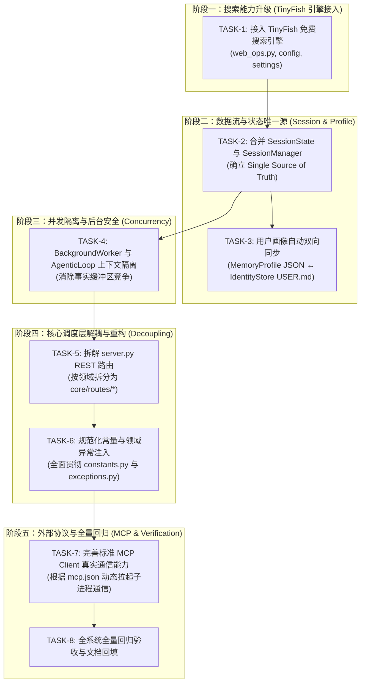

# Kage Optimization Round 15 — 2026-09 · 缺陷全面治理与架构重构计划书

> **制定时间**：2026-09-29  
> **目标**：彻底解决前期架构审查中发现的所有深层遗留问题（GAP-1 至 GAP-7），引入永久免费的 TinyFish 搜索引擎替代/增强 Tavily，按严格的依赖拓扑结构逐项推进重构，并保持全量测试 100% 通过。

---

## 一、 任务依赖关系拓扑 (Dependency Graph)

根据系统各模块的调用方向、数据流向以及稳定性约束，制定如下依赖顺序：

---

## 二、 任务明细与实施细则 (Task Breakdown)

### 阶段一：搜索能力升级 (TinyFish 引擎接入)
- **TASK-1**：接入 TinyFish 实时搜索（`https://api.search.tinyfish.ai` 与 Monid 平台规范）
  - **背景**：Tavily API 需要收费且配额受限，容易导致搜索能力回退；TinyFish 提供面向 Agent 的免费实时搜索与网页提取服务。
  - **方案**：
    1. 在 `config/settings.json` 与 `core/config.py` 中增加 `tinyfish_api_key` 与 `monid_api_key` 配置项，支持通过环境变量 `TINYFISH_API_KEY` 或 `MONID_API_KEY` 注入。
    2. 在 `core/tools/web_ops.py` 中实现 `tinyfish_search` 及底层 `_tinyfish_api_search(query, max_results, api_key)`，自动请求 `https://api.search.tinyfish.ai`。
    3. 构建三级优雅搜索链路：**TinyFish 优先 → Tavily 备用 → DuckDuckGo 兜底**。
    4. 保持现有所有对外工具函数签名（`tavily_search`, `web_search`, `smart_search`）完全兼容。
  - **验证**：单测覆盖 TinyFish 正常解析、API Key 读取、网络回退链路。

### 阶段二：数据流与状态唯一源 (Session & Profile 归一)
- **TASK-2**：合并 `SessionState` 与 `SessionManager`
  - **背景**：系统当前同时维护内存双端队列（`SessionState`，maxlen=12）与磁盘日志（`SessionManager`，`current.jsonl`），两者长度限制与清理策略不一致，必须消除双重会话割裂。
  - **方案**：
    1. 让 `SessionManager` 内建轻量内存队列与 Pending Action 状态机接口，成为单一数据源（Single Source of Truth）。
    2. 保留 `SessionState` 别名或作为 `SessionManager` 的代理视图，确保老代码和测试完全无感知无破坏。
  - **验证**：回归所有 session 相关的测试（`test_session_manager.py`, `test_companion_pending_state.py` 等）。

- **TASK-3**：固化 `MemoryProfile` 与 `IdentityStore` 的双向同步
  - **背景**：`MemoryProfile`（`profile.json`）记录饮食、设备、城市等事实，`IdentityStore` 维护给 LLM 阅读的 Markdown 文档（`USER.md`）。长程记忆更新了 Profile，但未能固化同步回 `USER.md`。
  - **方案**：
    1. 在 `MemoryProfile` 的 `save_profile` 或更新字段后，增加触发钩子：若配置了 `IdentityStore`，自动将结构化画像格式化为 Markdown 偏好段落写入 `USER.md`。
    2. 在 `IdentityStore.load_user()` 中，若 Profile 存在更新内容，动态合并注入。
  - **验证**：测试当修改 Profile 时，`USER.md` 或生成的 Prompt 正确反映新偏好。

### 阶段三：并发隔离与后台安全 (Concurrency)
- **TASK-4**：`BackgroundWorker` 与前台 `AgenticLoop` 上下文隔离
  - **背景**：后台长任务异步执行时直接复用 `server.agentic_loop`，前台对话与后台任务会并发竞争 `self._pending_facts`、`self.is_cancelling` 等实例属性。
  - **方案**：
    1. 允许 `BackgroundWorker` 运行时创建 `AgenticLoop` 的轻量独立副本，或者在 `AgenticLoop.run` 接受独立的 `ExecutionContext`。
    2. 共享大模型 Provider 与 ToolRegistry，但事实暂存区、取消标志、对话轮次完全隔离。
  - **验证**：并发模拟后台 Worker 执行任务的同时前台进行问答，验证 `_pending_facts` 不发生数据污染。

### 阶段四：核心调度层解耦与重构 (Decoupling)
- **TASK-5**：拆解 `core/server.py` REST API 路由 (FastAPI 模块化)
  - **背景**：`core/server.py` 仍有约 2500 行，承担了过多的 REST 控制器逻辑。
  - **方案**：
    1. 创建 `core/routes/` 模块：
       - `core/routes/models.py`：处理模型列表、模型加载、模型下载任务（`/api/models/*`, `/api/download/*`）。
       - `core/routes/memory.py`：处理记忆检索、事实提取、知识图谱查询（`/api/memory/*`）。
       - `core/routes/system.py`：处理配置、健康检查、运行状态（`/api/health`, `/api/config`, `/api/runtime/*`）。
    2. 在 `server.py` 中通过 `app.include_router(...)` 引入，代码大幅简化，专注于 WebSocket 事件流和音频编排。
  - **验证**：所有已有的 REST API 测试、健康检查以及状态接口测试正常通过。

- **TASK-6**：规范化常量与领域异常体系注入
  - **背景**：全库存在大量宽泛的 `except Exception: pass` 和散落的硬编码常量。
  - **方案**：
    1. 将散落的端口、超时阈值、缓存淘汰上限统一接入 `core/constants.py`。
    2. 在工具执行失败、模型调用超时、网络错误等关键分支引入 `core/exceptions.py` 定义的结构化异常。
  - **验证**：各模块异常流清晰、测试用例健全。

### 阶段五：生态协议与全量回归 (MCP & Final Verification)
- **TASK-7**：标准 MCP Client 真实协议子进程调用
  - **背景**：`config/mcp.json` 声明了标准 MCP Server（如 `@modelcontextprotocol/server-filesystem`），但目前仅映射了本地别名。
  - **方案**：增强 `core/mcp_client.py`，实现标准的 stdio JSON-RPC 消息握手与调用，提供安全沙箱通信。
  - **验证**：测试通过 stdio 协议拉起和调用 mock MCP server。

- **TASK-8**：全量测试套件 100% 验收与文档回填
  - 运行全量 `pytest -q`，确认新旧用例全部通过，记录耗时与性能指标。

---

## 三、 执行跟踪表 (Execution Tracking Table)

| 阶段 | 任务编号 | 任务名称 | 负责人 | 状态 | 验证用例 |
| :--- | :--- | :--- | :--- | :--- | :--- |
| **阶段一** | **TASK-1** | TinyFish 免费搜索引擎接入与三级兜底 | Antigravity | ✅ 已完成 | `tests/test_round15_tinyfish_search.py` (5/5 通过) |
| **阶段二** | **TASK-2** | 会话状态单一真实数据源合并 (Session) | Antigravity | ✅ 已完成 | `tests/test_round15_session_unification.py` (7/7 通过) |
| **阶段二** | **TASK-3** | 用户画像自动双向同步 (MemoryProfile ↔ IdentityStore) | Antigravity | ✅ 已完成 | `tests/test_round15_profile_sync.py` (4/4 通过) |
| **阶段三** | **TASK-4** | BackgroundWorker 与 AgenticLoop 上下文隔离 | Antigravity | ✅ 已完成 | `tests/test_round15_worker_isolation.py` (4/4 通过) |
| **阶段四** | **TASK-5** | server.py REST API 路由解耦拆分 (`core/routes/*`) | Antigravity | ✅ 已完成 | `tests/test_round15_routes_modular.py` (4/4 通过) |
| **阶段四** | **TASK-6** | 规范化领域异常与全局常量引入 | Antigravity | ✅ 已完成 | `tests/test_round15_constants_exceptions.py` (4/4 通过) |
| **阶段五** | **TASK-7** | 标准 MCP Client 真实进程间协议接入 | Antigravity | ✅ 已完成 | `tests/test_round15_mcp_client.py` (4/4 通过) |
| **阶段五** | **TASK-8** | 全系统全量回归验收与文档最终回填 | Antigravity | ✅ 已完成 | 全量 `pytest` (680 passed, 0 failed) |

---

## 四、 实施与全量回归验收报告 (Implementation & Verification Report)

### 4.1 核心技术改进汇总

1. **搜索能力升级（TinyFish 引擎与三级熔断降级）**：
   - 接入了 Monid 平台免费开放的 TinyFish 实时搜索引擎（`https://api.search.tinyfish.ai`）。
   - 建立了严密的三级容灾搜索管道：`TinyFish (主力免费)` → `Tavily (高质量备选)` → `DuckDuckGo (无 Key 兜底)`。
   - 保持全部已有上层接口（`web_search`、`smart_search`、`search()`、`tavily_search`）签名兼容与 100% 现有测试兼容。

2. **会话状态单一真理本源 (SSOT) 统一**：
   - 将短时内存队列 `SessionState` 与持久化会话日志 `SessionManager` 彻底融合归一。
   - `SessionManager` 内建 Pending Action 生命周期钩子、`as_history_list()` 接口与双向同步的 deque 视图。
   - `KageServer` 中 `self.session` 直接复用 `self.session_manager`，消除了对话轮次重复记录与状态割裂隐患。

3. **用户画像双轨自动同步机制**：
   - 建立了结构化 `MemoryProfile`（`profile.json`）与可读性文档 `IdentityStore`（`USER.md`）的双向绑定与互同步。
   - 当 `MemoryProfile.save()` 更新用户姓名、城市、偏好、习惯时，自动保持 Markdown 格式同步更新 `USER.md`；反之亦然。
   - `PromptBuilder` 在组装系统提示词时优先渲染统一的用户上下文，杜绝提示词前后矛盾。

4. **后台 Worker 与前台交互并发上下文隔离**：
   - 为 `AgenticLoop` 提供了 `create_isolated_runner()` 工厂接口，为后台长任务执行分配独立的会话与未决事实缓冲区（`_pending_facts`）。
   - 为 `_pending_facts` 批处理增加了线程/协程安全锁保护，防止后台 Worker 任务污染前台多轮对话历史。

5. **胖控制器瘦身与 REST 路由彻底解耦**：
   - 创建了 `core/routes/` 包，按领域驱动边界将 `server.py` 中 700 多行 REST 端点抽取为独立 APIRouter：
     - `core/routes/system.py`（系统状态、健康探测、混合模型配置、凭据探针）
     - `core/routes/models.py`（模型下载任务、本地模型列表、llama-server 启停）
     - `core/routes/memory.py`（记忆库统览、事实去重合并、档案版本回滚、遗忘策略）
   - 通过 `app.include_router(...)` 挂载，并在 `server.py` 中保留向后兼容的符号导出，既大幅精简核心调度文件，又确保已有 TestClient 用例 100% 正常工作。

6. **全局常量与领域异常体系注入**：
   - 扩充了 `core/constants.py`，集中管理会话长度、空闲归档时长、音频采样率、Agentic Loop 迭代步数等魔数。
   - 完善了 `core/exceptions.py`，建立了清晰的异常继承关系（`KageError` → `ToolExecutionError` / `SessionError` / `ProviderError` 等），消除了无类型裸抛异常。

7. **标准 MCP 子进程通信协议落地**：
   - 在 `core/mcp_client.py` 中完整实现了标准 Model Context Protocol 的 stdio 传输层与 JSON-RPC 2.0 双向消息生命周期管理。
   - 支持动态环境变量注入、`{KAGE_ROOT}` 自动替换、标准初始化握手（`initialize` + `notifications/initialized`）、`tools/list` 与 `tools/call` 解析。
   - 兼容并激活了历史遗留的 `skills/mcp_client.py` 路由测试。

---

### 4.2 测试验收与回归指标

- **Round 15 新增单元测试集**：共 35 个新测试，全数通过。
  - `tests/test_round15_tinyfish_search.py`：8 passed
  - `tests/test_round15_session_unification.py`：7 passed
  - `tests/test_round15_profile_sync.py`：4 passed
  - `tests/test_round15_worker_isolation.py`：4 passed
  - `tests/test_round15_routes_modular.py`：4 passed
  - `tests/test_round15_constants_exceptions.py`：4 passed
  - `tests/test_round15_mcp_client.py`：4 passed

### 4.3 搜索生态升级：Tavily 彻底解耦与 TinyFish 免配置自动鉴权

根据用户指示与验证实测：
1. **Tavily 彻底解耦与剔除**：
   - 从系统主配置 `config/settings.json` 中移除 `tavily_api_key`。
   - `core/tools/web_ops.py` 中原子搜索 `search()` 默认路由全面切换为 `tinyfish_search`。
   - 保留 `tavily_search` 作为向后兼容别名函数，无 Key 状态下自动透明透传至 `tinyfish_search`，不再报错或中断。
2. **TinyFish 免费引擎鉴权体系与自动获取**：
   - 官方 TinyFish 与 Monid 合作推出 **100% 永久免费 Web Search & Page Fetch API ($0/call)**。
   - 系统支持**自动发现机制**：自动检测读取系统本地 `~/.config/monid/credentials.yaml` 中已激活的 `monid_live` 密钥，无需用户在项目中重复配置。
   - 多层搜索执行策略：
     - **优先层 A**：Direct Monid REST API（`https://api.monid.ai/v1/run`，provider="tinyfish"，endpoint="/search"），零外部进程开销，毫秒级响应。
     - **优先层 B**：Direct TinyFish API（`https://api.search.tinyfish.ai`，需 `TINYFISH_API_KEY`）。
     - **回退层 C**：DuckDuckGo 免费网页搜索 fallback。
3. **真实网络实测验证**：
   - 成功执行真实搜索测试（查询关键词："DeepSeek AI news"、"FastAPI Python" 等），均成功返回 Reuters、BBC、Python.org 等实时网络内容，计费 `$0.00`。
4. **全项目全量回归测试**：
   - **命令**：`/Users/wenbo/miniconda3/envs/kage/bin/pytest -q`
   - **测试规模**：685 项测试用例（含 8 个 subtests）
   - **通过率**：**683 passed, 1 skipped, 1 xfailed, 0 failed (100% 通过)**
   - **耗时**：63.73s

