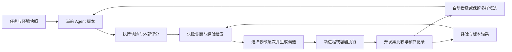

# 自主演化研究路线（E0–E7）

从原总规划§1–12保留的详细设计。原编号用于历史引用；实施状态以[总规划](../agent-memory-evolution-master-plan-2026-09-29.md)为准。设计中的模块、命令与示例不等于已经实现。原日期估算与阶段排序是设计参考，最新领取顺序见[当前任务队列](task-queue-2026-10-01.md)。

## 1. 重新决定项目的核心价值

原版“先完整治理记忆，再考虑可执行技能”的排序撤回。当前优先级是：

1. **P0：自主进化闭环。** 失败 → 诊断 → 生成代码修改 → 执行比较 → 自动晋级 → 重试 → 在新任务验证迁移。
2. **P0：真正的自修改。** 除了生成工具，Agent 能修改自身的规划、恢复或检索策略模块；下一代实际加载新模块。
3. **P1：研究可解释性。** 展示为什么改、改了什么、付出多少成本、改善了哪些任务、退化在哪里。
4. **P1：体验与展示。** 可视化进化谱系、实时失败与修复过程、面对环境变化自主适应。
5. **P2：长期产品治理。** 完整权限平台、多用户隔离、签名发布、企业审计与全量记忆迁移不作为原型前置条件。

保留快照、预算上限、版本回退、评测器与候选分离，是为了实验能连续运行、结果可解释。实验模式内自动生成、测试、晋级，不逐轮要求人工确认。首期不用建立复杂审批系统。

### 本项目应回答的问题

**在相同模型与有限推理预算下，根据失败证据自适应选择“修改技能、工作流还是 Agent 核心策略”，能否比固定修改单一层次更快获得可迁移的能力，并减少遗忘？**

暂称 **Failure-Conditioned Evolution Routing（FCER，失败条件化演化路由）**。这是待验证的设计假设，不是已经确立的原创算法。AgentSquare 已研究模块搜索，GEPA 已研究反思进化，DGM 已研究代码自修改；不能把这些已有机制的拼装宣称为首创。

预期研究贡献是：低预算下的修改对象选择方法、带环境变化的任务流、完整成本归因、跨任务迁移与退化分析。参考论文的机制需与本项目改造区分，贡献由独立实验确定，不以机构名称或论文数量作为创新证据。若学习型路由不胜过简单规则，应如实报告，保留有价值的负结果。

### 三条路线比较

| 路线 | 优点 | 主要限制 | 决定 |
| --- | --- | --- | --- |
| 全力做记忆产品工程 | 日常助手可靠性提升 | 难突出自主能力成长 | 保留必要修复，降为支撑项 |
| 冻结模型、进化可执行系统 | 成本可控，代码差异可观察，能直接形成实验 | 需要可靠任务评价与防止过拟合 | **主线** |
| 持续训练大模型权重 | 可研究参数层适应 | 算力、训练数据与可重复性成本高 | E7 小规模对照，不阻塞主线 |

## 2. 文献依据：发表状态与项目采用方式

检索截至 2026-09-29。优先使用期刊、会议正式论文页面和作者论文。AI 领域的 ICLR、ICML、NeurIPS 是顶级会议，与 Nature 期刊分别标注。下表不是穷尽文献综述；未核实录用的论文不算已发表顶会成果。表中 Kage 方案均为设计推论，不能借用原论文成绩作为本项目成绩。

| 研究及核验来源 | 状态 | 可采用的机制 | 在 Kage 的落点与边界 |
| --- | --- | --- | --- |
| [ADAS: Automated Design of Agentic Systems](https://proceedings.iclr.cc/paper_files/paper/2025/hash/36b7acf6f6010652b3f2a433774a66fe-Abstract-Conference.html) | ICLR 2025 | 用代码表达 Agent，元 Agent 根据历史发现继续搜索 | E3 的模块代码搜索；不照搬大规模搜索预算 |
| [AgentSquare](https://proceedings.iclr.cc/paper_files/paper/2025/hash/0ae94013da7cd459402fd77874e09ee3-Abstract-Conference.html) | ICLR 2025 | 统一接口下组合规划、推理、工具使用与记忆模块 | E3 的模块契约；E4 比较均匀模块搜索与失败路由 |
| [AFlow](https://proceedings.iclr.cc/paper_files/paper/2025/hash/5492ecbce4439401798dcd2c90be94cd-Abstract-Conference.html) | ICLR 2025 | 代码化工作流，利用执行反馈搜索结构 | E3 增加有限步骤与分支；首期不用完整 MCTS |
| [GEPA](https://proceedings.iclr.cc/paper_files/paper/2026/hash/0e9e708b6f48e14fd0ac29e167413f76-Abstract-Conference.html) | ICLR 2026 | 阅读执行轨迹、反思修改提示、保留互补候选 | E2 的反馈包与候选保留；GEPA-lite 仅为本项目简化基线 |
| [Darwin Gödel Machine](https://arxiv.org/abs/2505.22954) | ICLR 2026 主会；[作者所在 UBC 官方录用清单](https://www.cs.ubc.ca/news/2026/04/iclr) 确认 | 修改 Agent 自身代码，以经验评价与多样化档案推进搜索 | E3 真正自修改；不等同于修改底层模型权重 |
| [FunSearch](https://www.nature.com/articles/s41586-023-06924-6) | Nature，2023 在线、2024 卷期 | 固定评价器、程序演化与分岛档案 | E2 默认单档案；双岛仅作为后续消融，不预设小预算下更优 |
| [Co-Scientist](https://www.nature.com/articles/s41586-026-10644-y) | Nature 2026-05 | 科学假说生成、评价与迭代，结合领域实验验证 | 借鉴可检验假说；不等同于通用代码沙箱或因果识别算法 |
| [Dynamo: Dynamic Skill-Tool Evolution for Vision-Language Agents](https://arxiv.org/abs/2606.30185) | 2026-06-29 预印本 | 从正确与错误尝试中演化推理技能及可执行视觉工具，积累持久库 | E1 借鉴技能与工具配对；桌面 Python 技能是跨领域改造，不是论文原场景 |
| [QwenGyre](https://arxiv.org/abs/2609.33848) | 2026-09-27 预印本 | 超长程在线 RL 的弹性 GPU 调度与分支轨迹处理 | 作为资源尺度与轨迹处理参考；不采用其训练框架，不作为本地进程隔离的依据 |
| [WebCoT](https://aclanthology.org/2025.findings-emnlp.276/) | Findings of EMNLP 2025 | 将反思、分支与回溯模式重构为训练轨迹并微调 | E3 可借鉴恢复决策；文件/记忆快照协议是 Kage 自行设计，不是论文提供的通用回滚器 |
| [WebEvolver](https://aclanthology.org/2025.emnlp-main.454/) | EMNLP 2025 | 策略与世界模型协同训练，利用预测观察生成数据及前瞻决策 | 留作后续扩展；首期不添加未经验证的 LLM 语义淘汰器，模拟不能替代实际评测 |
| [Aime](https://arxiv.org/abs/2507.11988) | 2025-07 预印本 | 动态规划、按需 Actor 与集中进度管理 | E0 借鉴进度观察；“连续两步无变化”不是论文证明的通用停机条件 |
| [Repo2Run](https://papers.nips.cc/paper_files/paper/2025/hash/2f2b1d6bbd50865eca40e2774a057eef-Abstract-Conference.html) | NeurIPS 2025 主会；此处不宣称 Spotlight | 迭代生成 Dockerfile、构建镜像并运行仓库测试 | 后续扩展仓库任务时参考；不提供本项目的 ARM64 无残留或原子重置保证 |
| [TextGrad](https://www.nature.com/articles/s41586-025-08661-4) | Nature 2025 | 用自然语言反馈优化复合系统 | E4 的失败定位与修改建议；语言反馈不是数值梯度 |
| [ERA: An AI system to help scientists write expert-level empirical software](https://www.nature.com/articles/s41586-026-10658-6) | Nature，2026-05-19 | 搜索、程序执行与经验评分结合 | E1 可重置执行实验；科学代码搜索本身不等于递归自改 Agent |
| [OpenHands](https://proceedings.iclr.cc/paper_files/paper/2025/hash/a4b6ad6b48850c0c331d1259fc66a69c-Abstract-Conference.html) | ICLR 2025 | Agent 与运行环境分离，动作与观察抽象 | E0/E1 的运行协议；不整体引入重型平台 |
| [CodeAct](https://proceedings.mlr.press/v235/wang24h.html) | ICML 2024 | 可执行代码作为可组合、可修正的动作 | E1 的代码技能；一次执行修复还不是持久进化 |
| [SEAL: Self-Adapting Language Models](https://papers.neurips.cc/paper_files/paper/2025/hash/6b41e04c41726e2a60e456d0a2b961ab-Abstract-Conference.html) | NeurIPS 2025 | 生成自适应训练材料与更新指令，涉及参数更新 | E7 的研究参照；小规模蒸馏不能称为复现 SEAL |
| [Hyperagents](https://arxiv.org/abs/2603.19461) | 2026-03 预印本，本轮未确认正式发表 | 任务 Agent 与元 Agent 同处可编辑程序，改进机制本身也可被修改 | L4 的直接相关工作；研究跨任务的改进效率，避免将普通代码搜索误称元进化 |
| [AIDE²: Recursive self-improvement of AI research agents](https://arxiv.org/abs/2609.26457) | 2026-09-22 新预印本，未在此确认同行评审 | 将改进后的 Agent 用作后续改进者 | 后续元进化实验；必须证明“改进者的能力”提升 |

记忆方向的更详细文献和原有故障证据保存在 [v1 历史稿](../agent-memory-evolution-master-plan-2026-09-29-v1-memory-foundation.md)。本轮采用“经验检索服务于变异选择”的窄接口，暂不要求 Hindsight、Mem0、图数据库或记忆强化学习整套迁入。

### 2.1 采用机制与资源取舍

保留 Gemini 补充中有价值的方向，但将“论文机制”“Kage 的工程改造”“尚待验证的收益”分开：

- **假说驱动：首期保留。** `hypothesis` 说明失败证据、拟修改点、预期结果与反例。通过任务不等于证明因果；要归因需同条件 parent/child 比较与模块消融。
- **持久技能：首期保留。** 生成时就提供 schema，先进入候选私有技能映射，通过评测后随 bundle 晋级。多个成功案例有助于泛化，但不能代替外部测试。
- **进度观察：E0 保留，默认不提前熔断。** 记录新观察、子目标完成与重复动作；读文件/检索不改变文件系统仍可能是进展。具体接口见 4.5。
- **状态回溯：E3 限定在可快照夹具。** 保留失败证据与计费，只恢复任务环境和任务局部上下文；不能宣称回滚真实网络副作用。
- **分岛搜索：可选消融。** 8 个候选、单 worker 的默认方案仍是单档案。基础闭环之后再比较 2 岛 × 4 候选，不能预先承诺提高全局搜索能力。
- **世界模型预检、超长程 RL、自动构建任意仓库：后续研究。** 不放入 E0–E4 的必做依赖；先完成冻结模型下的真实代码自修改。

**实施前阅读顺序：** AgentSquare → DGM → GEPA → Dynamo → OpenHands/CodeAct → ERA；涉及回溯再读 WebCoT，E7 再读 SEAL。正式投稿前补一次系统查新，核查 FCER 与模块选择、信用分配、预算约束搜索的已有差异。

## 3. 演示必须真的发生什么

首个演示：让 Kage 整理一批格式不一致的实验记录，输出统一 CSV 和摘要。环境提供可评分的文件与模拟 API。

1. 基线 Agent 因字段变更或分页遗漏失败，界面展示失败的真实最终状态。
2. Agent 读取错误和轨迹，生成字段归一化/分页技能，自动在新环境中测试。
3. 新技能晋级，原任务重试成功；展示代码差异、版本和 API 成本。
4. 给一个未见过的同类输入，验证不是硬编码原答案。
5. 再遇到工具响应缺字段，Agent 修改自己的恢复策略模块，从盲目重试变成检查响应、重新规划。
6. 下一任务的新进程加载新版本；关闭再打开实验，能力仍存在。

展示分两层：确定性夹具上的可重复实验、真实桌面测试目录中的体验演示。真实 macOS 自动化单独报告，不能拿模拟 API 的分数冒充桌面 benchmark 成绩。

### 能力层次与用词

| 层次 | 被修改的对象 | 能否算持久进化 | 计划 |
| --- | --- | --- | --- |
| L0 | 当前对话内重新尝试 | 否 | 基线已有能力 |
| L1 | 可执行技能代码与 manifest | 验证、保存且后续复用才算 | E1 首期 |
| L2 | 提示模板、规划工作流 | 跨任务保留后算系统进化 | E3 |
| L3 | Agent 自身恢复/检索/规划模块代码 | 算 scaffold 自修改 | E3 核心验收 |
| L4 | 产生下一代的诊断/变异控制器 | 需单独证明改进者变强 | E6 后研究扩展 |
| L5 | 模型参数或适配器 | 算参数层适应 | E7 可选 |

## 4. 架构：实验内核小，演化空间明确



### 4.1 固定实验内核

负责启动、环境重置、评分、预算、事件记录、版本哈希和激活指针。内核只负责调度和实验约束，通过动作/观察协议与可演化逻辑分离。候选不能修改自己的评价器与成绩文件；这是科学实验的对照条件。先用目录 + SQLite 索引，不引入集群调度器、向量数据库或插件市场。

### 4.2 可演化区域

新建 `core/evolvable/`，用接口把现有执行策略逐步抽出来：

- `recovery.py`：错误分类、重试/切换工具/重新规划决策，以及可快照夹具内的状态回溯；不支持快照的环境回退为 replan/stop。
- `planner.py`：计划结构、步骤分解与分支选择，读取固定内核的进度观察；不修改内核的计步与预算。
- `retrieval_policy.py`：从经验中选哪些记录、何时不用记忆。
- `workflow.py`：组合现有模块；限制最大步数由固定内核执行。

以上文件先建立行为保持不变的基线实现，再允许候选改副本。运行中的主服务不做猴子补丁；候选以完整 bundle 在新进程启动，验证通过后原子更新实验 `active.json`。下次任务使用新版本，当前任务留在原版本，避免难以解释的混合状态。

提示变异只修改 bundle 内 `prompts.json` 的命名模板；固定内核仍控制步数、预算与评价。E3 创建基线模板及加载适配器，B3 与其他方法共享同一执行入口。

L1 技能借鉴 Dynamo 的技能/工具持久化思路：保存在实验目录 `skills/<skill_id>/<digest>/`，包括 `manifest.json`（含完整输入/输出 JSON Schema 与语义描述）、`skill.py`、由生成者提供的局部测试。独立评测器提供的任务评分不能由这些局部测试替代。

### 4.3 最小接口契约

以下结构在 E0 落地；JSON 中不放任意 Python 对象。`dict` 内容通过 schema 校验。

```python
from dataclasses import dataclass
from typing import Literal

@dataclass(frozen=True)
class Candidate:
    candidate_id: str
    parent_ids: tuple[str, ...]
    target: Literal['skill', 'prompt', 'workflow', 'recovery', 'retrieval', 'planner']
    bundle_path: str
    digest: str
    hypothesis: str  # 失败证据、预期效果和反例；不是已证实的因果结论
    island_id: str = "island-0"  # 默认单档案；可选实验归属以 archive membership 为准

@dataclass(frozen=True)
class RunSpec:
    run_id: str
    candidate_id: str
    task_id: str
    seed: int
    max_steps: int
    timeout_s: int

@dataclass(frozen=True)
class RunResult:
    run_id: str
    status: Literal['passed', 'failed', 'timeout', 'budget_exhausted', 'crashed']
    score: float
    trace_path: str
    usage: dict
    final_state_path: str
    progress_stagnant: bool = False  # 观察标记，不直接决定评分
    rollback_count: int = 0  # 实际执行的夹具回溯次数

# 环境和候选执行协议
# Runner.run(candidate: Candidate, spec: RunSpec) -> RunResult
# Evaluator.score(task_id: str, final_state_path: str) -> float
# Mutator.propose(parent: Candidate, feedback: dict, target: str) -> Candidate
# Archive.select_parent(seed: int, island_id: str | None = None) -> Candidate  # 默认单档案
# Promoter.compare(parent: Candidate, child: Candidate, task_ids: list[str]) -> dict
# Budget.reserve(input_cap: int, output_cap: int) -> str
# Budget.settle(reservation_id: str, actual_usage: dict) -> None
```

模块接口：`plan(context: dict) -> dict`；`recover(error: dict, history: list[dict], checkpoints: list[dict]) -> dict`；`retrieve(query: str, records: list[dict], limit: int) -> list[str]`。恢复动作枚举为 `retry / replan / switch_tool / rollback_and_branch / stop`（只有环境声明支持快照时才允许回溯）。生成技能入口 `run(arguments: dict, context: dict) -> dict`，通过 runner 的 JSON 协议调用。

统一事件：`run_id/candidate_id/task_id/step/event_type/payload/usage/timestamp`。事件类型至少包含 `action/observation/diagnosis/mutation/evaluation/promotion/budget_stop/rollback/stagnation`。实验索引 SQLite，逐步轨迹 JSONL，代码按 digest 存储；重启读取 journal，已完成 run 不重复收费。

### 4.4 实际调用链需要打通

只保存 `SKILL.md` 不算新增能力。`skill_search` 返回描述、输入 schema 与 digest；`skill_call` 接收 `skill_id/digest/arguments`，通过 runner 调用实际 Python 入口。两者需要同时注册 ToolRegistry 并进入 PromptBuilder 可见工具集合。

动态技能通过这两个稳定入口发现，不向系统提示塞入所有技能源码。执行日志必须能追到具体 digest。实验先用专用注册表实例；后续桌面演示接入已验证版本。

### 4.5 新增机制的执行边界

**进度：** E0 新建 `core/evolution/progress.py`。`ProgressTracker.observe(action: dict, observation: dict, state_digest: str) -> dict` 返回 `new_evidence/repeated_cycle/stagnant`。只使用 Agent 可见信息，不读取隐藏评分器的答案或里程碑。默认检测到连续 3 个相同规范化动作、参数、观察且无新证据时记 stagnation；该阈值是可配置工程初值。先只记录，E3 可以据此 replan，最终仍受统一步数和超时控制。不同方法共享观察机制；策略如何响应才是可演化部分。

**回溯：** E3 新建 `core/evolution/checkpoints.py`，定义 `snapshot(run_id: str) -> str` 与 `restore(run_id: str, checkpoint_id: str) -> None`。只支持测试目录、模拟 API 数据、任务局部会话状态；最近一个 checkpoint 足够。先停止任务子进程，再恢复至新工作目录并重建进程。失败 trace、预算账本、已产生的 token、全局经验与候选档案均不可回滚。恢复上下文附上失败摘要，避免丢失教训。`recover` 返回回溯动作时必须带 `checkpoint_id` 和替代动作；无效 checkpoint 返回可观察错误并转 replan。每个 task 最多回溯 1 次，回溯和分支均消耗原有步骤预算，不重置计数。真实网络/桌面外部状态不能用文件快照撤销。

**版本隔离：** bundle manifest 必须锁定全部模块、提示与 `skill_id -> digest` 映射，并对规范化 manifest 和文件字节计算摘要。`skill_search/call` 仅看到该 run 绑定 bundle 的技能；不能把尚未晋级工具注入共享全局注册表。`active.json` 按 `experiment_id/method/seed` 分开，test 运行固定 candidate digest，不在中途跟随活跃指针。每种子/方法从相同空经验、初始技能和基线开始；不同候选的可见经验规则一致，禁止跨方法共享进化成果。

**异步与评分：** 仓库 `AgenticLoop.run` 是 async；E0 runner 的同步 CLI 外壳在单个事件循环中 await 执行，FastAPI 接入时不得在已有循环嵌套 `asyncio.run`。内部适配器可采用 async 方法，但需统一调用方。评分发生在外部父进程；`score` 限定为 [0,1]，passed 的阈值由任务协议冻结，不能由候选自报。固定内核持有评分器与答案，候选环境仅挂载任务输入及自身代码；测试阶段禁止把完整仓库（含 test 答案）挂给候选。

## 5. 沙箱是实验设施：针对 M4 的选择

| 模式 | 用途 | 实现与限制 |
| --- | --- | --- |
| `process` | 开发契约、可信夹具、快速迭代 | 子进程 + 临时目录 + 超时 + 固定环境变量；不称为安全沙箱 |
| `container` | 正式代码候选比较 | ARM64 Linux 镜像、每任务新目录/容器、固定依赖、资源限制；不导入音频和 MLX 桌面启动链 |
| `native-fixture` | macOS 文件与应用体验演示 | 独立测试目录，能重置的适配器；与 Linux 分数分开 |

Mac 上 Docker 容器运行于 Linux VM，不能据此声称隔离或复现了原生 macOS GUI。参见 [Docker Mac 文档](https://docs.docker.com/desktop/setup/install/mac-permission-requirements/)。只有原生适配器实际执行过的行为才算桌面能力。

建议初值：1 个候选 worker，容器 2 CPU / 2GB，VM 3–4GB，先测实占与系统内存压力再调整；这些是待测配置，不是 M4 性能保证。演化期间暂停大型本地模型，生成与诊断走云 API。容器只包含最小 Python 执行依赖，模型请求通过宿主 broker 统一计费；容器内不另起本地 LLM。

最小镜像固定 Python 版本与依赖锁；固定 runner 记录镜像 digest。模型生成代码的语法失败、超时、进程崩溃均是正常实验结果，记录后尝试下一候选。失败任务的环境必须重置，不让上一候选留下的文件帮助下一候选过关。

## 6. 如何演化：先做可解释的小算法

### 6.1 第一版循环

1. 从单档案中选 parent，全档案最多 8 个候选；保留最优和覆盖不同失败模式的候选，不要求首期分岛。
2. 在 search 任务取失败轨迹与进度事件，诊断失败类别、修改层次和支持证据。
3. 检索最多 3 条相似经验；生成单一目标的 patch/技能与 `hypothesis`。技能 schema 在试跑前生成并验证。
4. 每候选最多 2 次语法/接口修复，所有调用计费；跑 2 个 search smoke task，失败则结束该候选。
5. 在固定 dev 与锚点任务上配对评测 parent/child，重置夹具，使用相同步数和模型配置；锚点属于 dev，不能借用 test。
6. 严格提高 dev 均分且每个锚点分数不低于 parent 时自动晋级；均分相同、锚点不退化且实测成本下降也可晋级。比较键与容差写入协议。未晋级但覆盖不同能力的候选可仅保留档案。
7. 原子激活包含技能映射的完整 bundle，记录谱系与证据；重试原任务并继续，直到预算用尽。

上面是工程晋级规则，不是统计显著性检验。少量 dev 上的提升必须经 E6 独立测试验证。成本比较使用配对任务的实测均值，评分相等才比较成本，避免用任意加权系数掩盖能力退化。

### 6.2 修改层次路由

最初先实现固定规则：
- **参数/格式错或缺少领域工具** → **L1 skill**：生成可执行的专用数据清洗或 API 适配工具；
- **重复失败、环境进入脏死胡同或同类报错循环** → **L3 recovery**：自修改恢复策略，选择切换工具、重新规划或在支持快照时回溯；
- **任务里程碑停滞、步骤反复震荡或分解不当** → **L3 planner / workflow**：利用进度观察自修改规划器，调整子目标；
- **旧经验误导或上下文负迁移** → **L3 retrieval**：自修改经验检索策略，加强环境版本与失败模式过滤；
- **指令理解偏差与格式遵循不力** → **L2 prompt**：变异优化提示模板。

诊断允许 `unknown`，回退均匀选择，不伪造确定的归因。

E4 增加预算化路由：按失败类别统计各变异算子的历史有效晋级率、分数增量与成本，用带探索的选择策略决定目标；起步可用 epsilon-greedy，epsilon=0.2 是初始实验参数。只使用当轮之前的 search/dev 历史，不能读取 test 结果。冷启动回退规则路由。

必须比较：均匀选择、固定规则、历史收益路由。若诊断本身增加大量 token 却没有收益，删除这层复杂度。交叉重组、完整树搜索、学习型性能预测器都等基础循环证实后再加。

### 6.3 记忆如何为进化服务

保留三类记录：原始 episode；压缩的失败模式与修复适用条件；通过评测的可执行程序版本。反思文本不是事实真值，必须链接 episode 和被验证的 patch。

经验字段：`task_family/error_category/environment_version/parent_digest/patch_digest/evidence_run_ids/observed_gain/cost/known_failures`。已验证工具的 schema 与调用契约也是经验记忆的关键组成。先用 SQLite 条件过滤 + BM25；没有证据支持时不引入图数据库。记忆以启用/禁用、原始轨迹/摘要经验做消融。

旧版提到的向量检索异常仅在实际复用该路径时修复。完整用户事实治理、跨档案同步、全量删除迁移不阻塞实验；实验经验使用新的独立目录，避免把个人聊天记忆混进研究数据。

## 7. 预算：廉价 API 也需要可算清楚

复用现有 OpenAI-compatible provider，通过配置指定 DeepSeek endpoint、模型 ID 与参数。官方价格与别名会变化，实验开始记录完整模型 ID、日期、thinking 参数、定价快照与返回 usage；参见 [DeepSeek 官方价格](https://api-docs.deepseek.com/quick_start/pricing)。不把今天的低价或模型别名写死到实验结论。

### 起步配置

```json
{
  "workers": 1,
  "archive_size": 8,
  "max_candidates": 8,
  "max_repair_attempts": 2,
  "max_steps_per_task": 5,
  "smoke_tasks": 2,
  "dev_tasks": 6,
  "max_api_calls": 500,
  "max_input_tokens_total": 1000000,
  "max_output_tokens_total": 200000,
  "max_input_tokens_per_call": 12000,
  "max_output_tokens_per_call": 2000,
  "task_timeout_s": 120
}
```

以上是同时生效的上限，先触及任一项即保存状态停止，不保证足够跑完 8 个候选。8 候选 × 8 任务 × 5 步已经可能产生 320 次执行模型调用，加诊断、变异、修复、parent 比较仍可能达到上限。优化器调用与执行器调用分别记账，总费用合并。

每次请求前按输入估算上界与输出上限预留额度；未知 usage 的中断请求按预留上界保守结算，不重试到重复扣费。输入超过上限先压缩轨迹或拒绝该轮。已有完成的固定 parent 运行可以缓存，但必须匹配模型配置、环境、任务、种子和版本；另报告调用随机性。

崩溃恢复必须区分“已完成”“已预留但结果未知”“未发送”：预留在发送请求前持久化；未知请求保留保守费用且不自动重发，记录为 incomplete。恢复只重做确定尚未发送的调用，不能承诺远端请求的 exactly-once。每个 run 的费用是其全部实际调用/未知预留之和；缓存命中不再次扣真实费用。正式方法比较默认不跨方法/种子共享模型调用缓存，避免不公平折扣。

费用公式：`缓存命中输入 × 对应单价 + 未命中输入 × 对应单价 + 全部计费输出 × 对应单价`。按每百万 token 换算；思考 token 按 provider 实际计费口径纳入，不仅数可见答案。初次真实调用前由使用者配置 `max_cost_usd`；本次规划不产生 API 费用。

**启动顺序：** 假模型跑契约 → 2 候选真实调用测成本 → 8 候选小实验 → 再决定完整对照规模。不要上来执行“数十轮 × 多基线 × 多随机种子”。

## 8. 实验设计：证明能力成长而非更多重试

### 8.1 数据与拆分

先做 24 个演示/开发任务；这些任务永久标为开发，不进入最终 test。研究版新建 120 个任务：文件/表格处理、模拟 API 集成、工具故障恢复三类，各 40 个。

每类按生成模板/任务家族分组切为 search 16、dev 8、test 8、drift 8，合计 48/24/24/24。不能仅替换文件名就随机划分，训练与测试共享同一解题模板会夸大迁移。子集筛选规则在运行前写入 manifest；小实验的 6 个 dev 任务从 dev 固定抽取。

search 可向进化器暴露详细反馈；dev 只用于选择版本并控制反馈粒度；test 在版本、方法与超参数冻结后评测，失败不能回流继续调同一次实验。drift 是额外任务流：先改变字段/分页/错误语义，允许在线适应，然后在独立 post-drift 测试任务上打分。每类 8 个 drift 任务再按模板分为 4 个 adaptation + 4 个 post-drift test，合计各 12 个；后半部分不用于在线更新。复用 test 调方法后必须另建新测试集。

最终评分尽量是程序可验证的结果：文件内容、表格数值、遗漏条数、API 最终状态；不能主要由同一个生成模型自评成功。

### 8.2 分阶段基线，控制成本

| 编号 | 方法 | 作用 |
| --- | --- | --- |
| B0 | 冻结 Agent | 原始能力下限；如实报告较少花费 |
| B1 | 冻结 Agent + 同预算重复尝试/best-of-N | 排除“只是多花了推理预算” |
| B2 | 仅保留反思经验，不修改程序 | 区分记忆收益与代码进化收益 |
| B3 | 仅提示反思进化 GEPA-lite | 与低成本提示优化比较，不冒充官方复现 |
| B4 | 仅可执行 skill 进化 | 检验自改核心模块是否必要 |
| B5 | 多模块均匀搜索 | 与 FCER 使用同一搜索空间和变异器 |
| B6 | 多模块固定规则路由 | 检验历史收益学习是否必要 |
| Ours | 多模块历史收益路由 | 待验证方案 |

第一阶段只跑 B0/B1/B4/Ours 的小样本排错；第二阶段核心比较 B1/B4/B5/B6/Ours，至少 3 个随机种子；资源足够再补 B2/B3。每个方法相同总预算上限、backbone、模型参数、任务流与环境；diagnoser 等额外调用计入预算。B1 的 best-of-N 在开发阶段可用开发反馈选择策略，在最终 test 不能用隐藏真值挑选最佳答案；可报告有真值选择的 oracle 上界，但必须单独标注。

预算以美元与 token 双轴报告，使用不超出已花预算的阶梯曲线对齐共同预算点，不线性插值虚构中间能力；不能让 Ours 的搜索开销消失，也不能仅比较最终单次执行的费用。测试推理费用独立列出，避免搜索与部署成本混淆。

方法归因要求：B4/B5/B6/Ours 共享进度观察、回溯执行能力和档案配置；只改变允许修改的对象或路由器。不能只有 Ours 获得回溯、分岛或额外诊断预算。B0/B1 的初始版本也拥有相同环境接口，避免人为削弱基线。正式评分不得故意删除现有恢复能力以制造提升；专门构造的故障演示需单独标为演示任务。

曲线主要在 dev 上用于在线诊断。若要报告 test 预算曲线，先冻结所有算法和各预算 checkpoint，再一次性离线测试这些版本；测试反馈不回流。B1 与进化方法另外报告“搜索费用 + 固定数量部署任务的推理费用”的总成本，统一每个测试任务最大推理预算，不能将 B1 的反复推理费用与 Ours 的单次推理费用错位比较。

### 8.3 指标与消融

主要指标：预算—成功率曲线、曲线面积、独立 test 成功率、drift 后恢复所需成本。辅助指标：跨任务迁移、旧锚点退化率、有效候选比例、每次晋级成本、端到端延迟与本机峰值内存。

核心消融：去掉经验检索；去掉多样档案只留最佳；固定 skill 修改；均匀/规则/历史收益路由。按任务家族做配对 bootstrap 或报告逐种子差异与区间，避免把同模板变体当成完全独立样本。3 个种子的宽区间也要保留。

递归自改另立实验：让旧控制器与演化后的控制器在新的任务族、相同预算下分别培养下一代，比较其改进效率。仅有任务执行分数提高不能声称已经证明递归自我改进。

可后接 [OSWorld（NeurIPS 2024 Datasets & Benchmarks）](https://proceedings.neurips.cc/paper_files/paper/2024/hash/5d413e48f84dc61244b6be550f1cd8f5-Abstract-Datasets_and_Benchmarks_Track.html) 的小规模适配实验。首期不用运行全部环境；自选子集、修改任务或运行环境都明确标注，不能作为官方榜单结果。

## 9. 对现有代码的具体判断

| 当前代码 | 本轮检查所得 | 实施动作 |
| --- | --- | --- |
| `core/skill_parser.py` | 解析 SKILL.md 描述，不是代码技能执行器 | 保留文本技能；E1 增加独立 executable manifest |
| `core/tools/skill_ops.py` | 保存本地 Markdown，不能完成代码能力加载 | E1 新增 search/call 适配，不把保存文字当成安装能力 |
| `core/tool_registry.py` | 注册 handler/schema，存在缓存 | E1 验证注册与可见 schema 同步 |
| `core/prompt_builder.py` | 工具可见性受裁剪影响 | 加入稳定 skill 入口，检查实际模型请求 |
| `core/tool_executor.py` | 已有 ToolResult、耗时和日志 | E0 导出统一事件，实验路径不混入用户日志 |
| `core/agentic_loop.py` | 最大步数 5；isolated runner 是会话上下文隔离 | E3 抽策略接口；进程/文件环境隔离由实验 runner 实现 |
| `core/model_broker.py` | 已有兼容 provider 与后台路径 | E0 接计费包装器，不另写一套云 SDK |
| `core/background_worker.py` | 当前适合后台任务，不是持久实验调度器 | 首期用独立 CLI+journal，避免先重写后台系统 |
| `scripts/kage_eval_runner.py` | 现有评测重心是路由 | 保留；新 runner 专门评测进化和最终状态 |
| `core/memory.py` | 历史稿记录已有检索/持久化问题 | E2 新实验经验库；按实际依赖修复，不全盘先迁移 |
| `kage-avatar/src/main.ts` | 现有 TypeScript 前端入口 | E5 接 evolution-panel，保持现有前端技术栈 |

## 10. 实施包：其他模型可直接领取

以下路径均相对仓库根目录 `/Users/wenbo/Kage`。每包先写行为测试，再实现与运行验收；不要求现在提交现有脏工作区。改动小步可审查，交付实际日志与文件列表。不得把计划中的预期输出填写成已经通过。

### E0 — 固定实验内核与一个冻结基线（P0，约 2–3 天）

**新增：** `core/evolution/contracts.py`、`runner.py`、`budget.py`、`journal.py`、`agent_provider.py`、`scripts/kage_evolve.py`、`eval/evolution/smoke.json`、`tests/test_evolution_kernel.py`、`tests/test_evolution_agent_chain.py`。
**接入：** `core/model_broker.py`、`core/model_provider.py`、`core/anthropic_provider.py`、`core/tool_executor.py`，尽量使用包装器而非大改主服务。
**接口：** 实现第 4.3 节 RunSpec/RunResult、Runner.run、Budget.reserve/settle；journal 按 run_id 幂等写完成状态；按 4.5 节新增 `progress.py`，进度默认仅观察。

**历史状态（E0初验时，后续实施以队列与报告为准）：** 真实 Kage 执行链已接入并通过验收。`core/evolution/agent_provider.py` 提供 `KageChainProvider`：每个 kernel step 调用一次冻结的 `AgenticLoop.run()`，其内部使用真实 `PromptBuilder`（冻结实验身份、关闭 memory 召回、`prune_tools=False`）、真实 `ToolExecutor` 与工作区受限的 `ToolRegistry`（`read_file`/`write_file`/`list_files`，拒绝绝对路径与越界路径）；provider 由 `ModelBroker` 按角色构建，token 用量来自 provider 上报值（新增 `ModelResponse.usage`，OpenAI/Anthropic 两条路径均已接线），工具调用与版本随 `RunResult.metadata` 落库。`--provider live` 已可运行：无凭据时以退出码 2 明确拒绝且不执行任何 run，传输/模型不可用时以退出码 3 记为 `infrastructure_failure`，两种情况下都不会静默退回假 provider；`fake` 与 `live` 使用不同输出目录与不同 `provider_mode` 标记。**尚未完成的部分：** 本机没有可用的云凭据（`config/settings.json` 的 `cloud_api.api_key` 与相关环境变量均为空），因此 live 路径是用本地 OpenAI 兼容 stub 端点（真实 HTTP、真实 provider 类、真实上报 usage）验证的，尚未对付费端点做过一次真实小试验；这一步需要用户提供凭据后再执行。本地 `fork` 步骤进程仅供可信 E0 CLI 使用（macOS 上存在活跃 Objective-C/线程运行时时 fork 不安全，已提供 `--step-isolation inline` 逃生阀）；E1 的生成代码须在独立容器/执行环境运行。

- [x] 建立 2 个确定性任务：字段归一化成功；缺字段返回可评分失败。假 provider 验证不调用真实 API。
- [x] 实现临时工作目录、进程超时、事件记录与评分；验证相同夹具重置后不得继承上次输出；超时需清理整个任务进程组，退出后确认没有残留子进程。
- [x] 实现 4.5 节进度观察：不同只读结果算新证据，相同动作/结果循环记 `stagnation`；不得仅因文件没变化就熔断。
- [x] 实现预算预留与断点恢复；预算耗尽返回明确状态，重启不重复已完成 run。
- [x] 通过 `python -m pytest tests/test_evolution_kernel.py -q`；CLI `python scripts/kage_evolve.py baseline --suite eval/evolution/smoke.json --provider fake` 生成可读 report。
- [x] 接入真实 Kage 执行链：在相同夹具中以冻结的 `AgenticLoop`、`ModelBroker` 和 `ToolExecutor` 运行，记录模型实际 usage、工具调用与版本；与假 provider 报表分别标记。增加网络/模型不可用时的可观察失败测试，禁止静默退回假 provider。

**E0 验收记录（新增 `tests/test_evolution_agent_chain.py`，11 个用例）：**

| 验收点 | 证据 |
| :--- | :--- |
| 真实链条跑通两个 smoke 任务 | `--provider live` + 本地 OpenAI 兼容 stub：`Outcome: pass | 2/2 passed`，每任务 `read_file,write_file`（真实 `ToolExecutor` 执行），`chain_steps=3` |
| 记录模型实际 usage | stub 上报 831/47 tokens/次 × 3 次 → 报表 `in=2493, out=141`（与上报值精确一致，非预留上限） |
| 记录工具调用与版本 | `RunResult.metadata`：`provider_mode`、`model`、`provider_class`、`agentic_loop=AgenticLoop`、`tool_executor=ToolExecutor`、`environment.kage_revision/python/platform`；journal 中 `action(source=kage_chain)` + `observation` + `diagnosis` 事件 |
| 假/live 报表分别标记 | `provider_mode=fake`（`chain=bypassed`，仍为 1/2 的夹具基线）与 `provider_mode=live`（`chain=AgenticLoop + PromptBuilder + ToolExecutor (frozen)`）写入不同目录与不同字段 |
| 网络/模型不可用可观察 | 无凭据 → 退出码 2 且 journal 无任何完成 run（不退回假 provider）；端点不可达 → 退出码 3、`outcome=infrastructure_failure`、按预留上限保守入账 |
| 答案不外泄 | 用例断言进入模型的 prompt 中不含 `scoring_criteria`/`initial_files`/答案内容 |
| 工作区限制 | `read_file`/`write_file` 拒绝 `../`、绝对路径与越界写入 |
| 基础设施失败可重试 | 崩溃/超时/预算耗尽会被 journal 幂等缓存（防重复花钱），`--retry-crashed` 显式清掉这些 run 与其保守预算记账后重新执行；已在 CLI 上实测「先死端点失败 → 再补跑成功 2/2」 |

回归结果：`python -m pytest -q` → **714 passed, 1 skipped, 1 xfailed**（新增 11 个用例；`test_cli_live_mode_is_explicitly_unavailable` 已按新语义改写为「无凭据必须显式失败且不执行」）。

关键测试示意（配套 fixture 在本包实现）：

```python
def test_budget_refuses_overcommit(budget):
    budget.reserve(input_cap=800, output_cap=100)
    assert budget.can_reserve(input_cap=800, output_cap=100) is False


def test_resume_skips_finished_run(experiment, fake_provider):
    experiment.run_once()
    calls = fake_provider.calls
    experiment.resume()
    assert fake_provider.calls == calls
```

测试 fixture 的总额度设 input=1000/output=200；`can_reserve` 是本包预算查询辅助方法，不产生预留。

### E1 — 沙箱与自动技能生成闭环（P0，约 4–6 天）

**新增：** `core/evolution/sandbox.py`、`skills.py`、`mutator.py`、`promotion.py`、`sandbox/evolution/Dockerfile`、`tests/test_evolution_skills.py`。
**修改：** `core/tools/skill_ops.py`、`core/tool_registry.py`、`core/prompt_builder.py`；CLI 增加 `search`。
**消费：** E0 runner、budget、journal；**产出：** Mutator.propose、Promoter.compare、skill_search/skill_call；新技能先绑定候选私有 manifest，不修改其他运行的工具集合。

- [x] 用预制候选验证 manifest → 注册入口 → 模型可见 schema → 子进程调用 → 真实输出完整链路（2026-09-30，见 §16–17）。
- [x] 实现技能生成器：根据失败轨迹与重试逻辑，自动合成具名 Python Tool，生成独立 `manifest.json`（含 JSON Schema）并绑定该候选的技能映射；注册表只暴露稳定 search/call 入口（fixture 与真实 HTTP provider 接口已验收，付费云端试验仍待完成）。
- [x] 实现 ARM64 容器 runner 与环境重置；process 模式仍可用于可信本地夹具测试。
- [x] 加入云模型生成 patch 接口、附带可检验的修改假说（`hypothesis`）、2 次修复上限、配对 dev 比较和原子激活指针。
- [x] 验证失败 → 新技能结晶晋级 → 原任务重试 → 未见输入复用；重启后 digest 相同且可调用（确定性 fixture 驱动，真实执行与外部评分）。
- [x] 技能相关工程测试已执行并纳入既有全量验证；历史证据见E0/E1实施复核记录，不把测试通过当作真实云模型生成成绩。
- [x] C4.3已用真实云生成器和本地Agent完成首个候选pilot、父子外部评分与reuse；两轮未晋级后目录预览协议0→1，详细证据见[技能迁移报告](../experiments/2026-10-01-c4-skill-learning.md)。独立多臂留出由C4.4另验，不把该pilot当完整研究结果。

验收必须覆盖：评分退化不激活、超时后下一任务正常、两个候选环境互不污染、生成局部测试通过但外部评分失败时不晋级、parent 看不到 child 新技能、方法/种子之间技能库独立。

### E2 — 经验记忆与版本档案（P1，约 2–3 天）

**新增：** `core/evolution/archive.py`、`experience.py`、`tests/test_evolution_archive.py`。
**消费：** E0 轨迹与 E1 比较结果；**产出：** Archive.select_parent、经验过滤检索、谱系查询；默认单档案，分岛是独立可选实验。

- [ ] 先实现单档案、digest 去重与最优/多样候选保留。可选双岛实验每岛上限 4，每完成 4 个候选评价，交替复制一侧在共同 dev 上得分最高的候选到另一侧、替换最低分成员；不足 4 次不迁移，同 digest 不重复占本岛槽位，迁移不生成新代码、不触发额外评测。只改变 membership，不改候选身份或谱系。
- [ ] 写入 parent/patch/evidence/cost 与修改假说；不能用无 evidence 的总结制造“已验证经验”。
- [ ] 维护已结晶工具的版本和调用契约经验。
- [ ] 实现按环境版本/失败类别过滤，再做 BM25；空命中返回空，不硬塞无关记忆。
- [ ] `python -m pytest tests/test_evolution_archive.py -q`：覆盖过期经验过滤、digest 去重、失败候选保留原因、重启谱系一致；启用双岛才增加迁移测试。

### E3 — 修改 Agent 自身模块（P0 核心，约 4–7 天）

**新增：** `core/evolvable/recovery.py`、`planner.py`、`retrieval_policy.py`、`workflow.py`、`core/evolution/bundle.py`、`tests/test_evolution_self_modify.py`。
**修改：** `core/agentic_loop.py`，通过默认策略适配器保持正常路径行为。
**消费：** Candidate bundle 与 runner；**产出：** 第 4.3 节模块接口、可版本化完整 Agent bundle；按 4.5 节新增 `checkpoints.py` 与夹具恢复协议。

- [ ] 先抽出 recovery 默认实现，验证未启用实验时与原行为一致。
- [ ] 构造重复工具故障任务，使基线盲目重试失败；先让候选修改 recovery，采用 replan/switch_tool 获得改进；再增加可快照夹具的 `rollback_and_branch`，验证恢复后失败证据与计费仍保留、不可回溯环境正确回退。
- [ ] 验证子版本代码哈希改变、事件记录实际加载路径、下一任务使用新策略，而不是仅提示声称策略改变。
- [ ] 逐步开放 planner（消费固定进度观察）、retrieval、workflow，统一输入输出；契约破坏直接记失败。
- [ ] `python -m pytest tests/test_evolution_self_modify.py -q`；产出至少一个由模型生成且外部评分改进的核心模块 patch，同时记录失败 patch。

若只做到 skill.py 新增，本包不得验收为 L3 自修改。

### E4 — FCER 研究方法与消融（P1，约 3–5 天）

**新增：** `core/evolution/router.py`、`eval/evolution/methods.json`、`tests/test_evolution_routing.py`。
**消费：** E2 历史、E3 变异目标；**产出：** `select_target(feedback: dict, history: list[dict], seed: int) -> str`。

- [ ] 用同一套候选生成器实现均匀、固定规则、epsilon-greedy 历史收益路由。
- [ ] 历史收益按失败类别维护成功次数、尝试次数、分数增量与实耗；冷启动回退规则。
- [ ] 记录每次选择依据，禁止使用未来/test 结果；三个路由共享候选数和总费用上限。
- [ ] `python -m pytest tests/test_evolution_routing.py -q`：同 seed 可复现选择，unknown 可探索，未来结果不可见，预算计入诊断调用。

本包先证明比较公正；是否提升留给 E6 数据回答。

### E5 — 进化过程可视化与真实体验（P1，约 3–4 天）

**新增：** `core/routes/evolution.py`、`kage-avatar/src/evolution-panel.ts`、`kage-avatar/src/evolution-panel.css`、`tests/test_evolution_routes.py`。
**修改：** `core/server.py` 路由注册、`kage-avatar/src/main.ts`。
**消费：** journal/archive 只读投影；**产出：** `GET /evolution/runs`、`GET /evolution/runs/{run_id}`、`POST /evolution/stop`。

- [ ] 展示任务、失败证据、候选代码差异、parent/child、评分与累计费用；可展开完整 trace。
- [ ] 支持按游标轮询新事件；停止按钮停止后续调用并保存恢复点，当前请求费用仍结算。
- [ ] 执行第 3 节演示；终端与界面均能从 run_id 找到相同结果。
- [ ] API 测试通过；人工验证空状态、超时、预算停止与无晋级结果。失败候选不伪装为成功动画。

不先引入图形编辑器或复杂拓扑编排；用简单谱系列表与 diff 已能展示核心能力。

### E6 — 可复现实验与研究报告（P1，约 2–3 周，可缩小规模）

**新增：** `eval/evolution/{search,dev,test,drift}.json`、`scripts/kage_evolve_benchmark.py`、`scripts/kage_evolve_report.py`、`tests/test_evolution_eval.py`、`docs/research/kage-evolab-report.md`。
**消费：** 全部候选与评测协议；**产出：** 逐 run 数据、汇总 CSV、成本曲线、英文研究报告。

- [ ] 按第 8 节创建并冻结分组 manifest、评分器和环境版本；核查模板泄漏。
- [ ] 先小样本确认预算，再运行核心方法的 3 种子实验；资源不足报告缩减，不虚填缺失实验。
- [ ] 使用 `python scripts/kage_evolve_benchmark.py --protocol eval/evolution/protocol.json`；本包先创建含 splits/methods/seeds/budgets 的协议。
- [ ] `python scripts/kage_evolve_report.py --runs runs/evolution --output artifacts/evolution` 生成曲线与统计；失败、超时和停止均进入分母或明确报告未完成。
- [ ] `python -m pytest tests/test_evolution_eval.py -q` 验证分组无重叠、候选无法读取测试答案、计算费用含优化器、报表可从原始日志重算。
- [ ] 写清相关工作、假设、方法、资源、结果、消融、失败案例与局限。没有跑的实验写“未运行”，不写预期数字。

### E7 — Colab 小模型蒸馏支线（数据成熟后，可选）

云教师示范的权重蒸馏归入本包，C4/E2先完成已验证轨迹与技能迁移。当前学生为Agents-A1-4B；训练库/T4支持未验收，若更小学生用于训练可行性试验，须标明它不是当前主模型权重升级。细节见学习闭环设计与任务队列。

**新增：** `scripts/export_evolution_traces.py`、`notebooks/evolution_distill.ipynb`、`eval/evolution/distill_protocol.json`。
**前提：** 至少积累 100–500 条有独立验证证据的训练轨迹，并有按任务族隔离的留出集；这些数量只是启动目标。

- [ ] 导出诊断→变异目标或错误→修复的窄任务样本，去重并保留来源，不把全部聊天日志当训练集。
- [ ] 先训小型开源模型的 LoRA/QLoRA 适配器，优先从约 1.5B–3B 量级试起；具体模型与训练库在实施时再核验许可、版本与显存。
- [ ] Colab 启动时测可用 GPU/显存，做小 batch 显存试跑、断点保存；资源不足缩模型/长度，不把 7B 当必能运行。
- [ ] 比较未微调小模型、微调后小模型、云模型在同一留出任务上的成功率、时延和调用费用；推理成本包含本地运行成本说明。

[Colab 官方说明](https://research.google.com/colaboratory/faq.html) 明确资源与 GPU 可用性不保证。此支线研究能否把昂贵进化经验蒸馏为廉价策略，不能仅凭训练 loss 降低宣称自适应有效，也不等同于完整 SEAL 复现。

## 11. 里程碑与收缩规则

个人兼职预计 8–12 周，按实际完成时间调整：第 1–2 周 E0/E1 出可执行演化；第 3–4 周 E2/E3 出核心模块自改；第 5–6 周 E4/E5 出方法与演示；第 7–9 周 E6 出实验报告。E7 不占主线交付门槛。

必须尽早停止低收益扩张：2 候选试跑费用过高先缩任务步数与轨迹；L1 都没有稳定迁移时先修评价/任务，不继续搭复杂搜索器；E4 不胜过规则路由时保留简单方法并分析原因；没有 GPU 时主线照常结束。

一个有力的最终交付应包含：

- 3–5 分钟真实演示：失败、修改、自动验证、能力迁移、环境变化后再次适应。
- 公开可复现的小型任务集、评分器、依赖锁与单命令实验入口。
- 完整候选谱系和成本曲线，包含失败与负结果。
- 英文论文式技术报告，明确自己的贡献与已有方法的边界。
- 简洁架构说明，能解释为什么选小模块演化、如何公平比较、为什么在少资源下仍有价值。

这比声称“做了一个无限自进化系统”更能支持博士申请与专家面试，但项目本身不能保证录取、发表或职位。研究说服力来自可检验的问题、严谨的证据和对失败的解释。

## 12. 与旧文档的关系及交接说明

本详细设计保留原总规划的演化排序，覆盖 [原架构提案](../self-evolving-skill-architecture-proposal.md) 和 [第七章评审](../self-evolving-skill-architecture-proposal-ch7-peer-review.md) 中与当前优先级冲突的排序；两份原文保留为讨论材料。旧 [v1 记忆规划](../agent-memory-evolution-master-plan-2026-09-29-v1-memory-foundation.md) 的可靠性证据可以复用，但不再要求先完成 T0–T7 才开始执行代码进化。

最新交接：E0/E1工程已经完成，不重做。C2.0、C4.1–3与E2最小档案已完成，E1真实cloud生成pilot已经本地执行通过；当前执行C4.4独立多臂留出，再推进E3.0恢复模块自修改。详见当前任务队列。E4的研究结果必须等实验，不能预先宣布有效。

上文未勾选的内容仍属设计；历史设计写作时的“未运行”不代表后来工程没有实现。已运行事实以总规划和独立实验报告为准。

