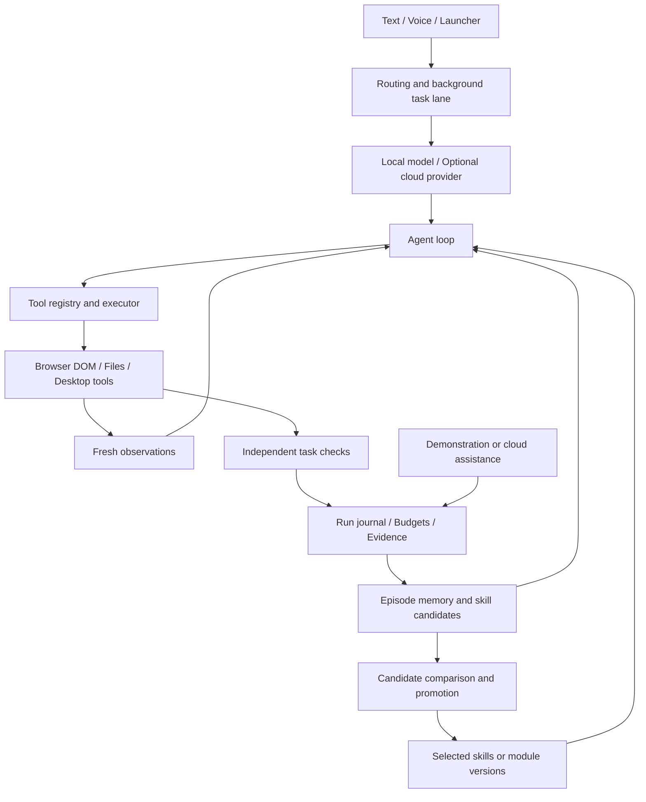

<div align="center">

# Kage (影)

### Toward Self-Evolving General-Purpose Computer Agents

**Computer use × Continual learning × Procedural memory × Agent self-modification**

An experimental agent system that turns execution experience into reusable capabilities—and explores how agents can improve their own architecture.

[Roadmap](docs/agent-memory-evolution-master-plan-2026-09-29.md) · [Task queue](docs/plans/task-queue-2026-10-01.md) · [Experiment reports](docs/experiments/README.md) · [Issues](https://github.com/lemon5227/Kage/issues)

</div>

Kage explores a larger question than desktop automation: **can an agent become more capable through its own experience, human teaching, and selective changes to the system that drives its decisions?**

The goal is a general-purpose computer agent that works across browsers, files, and native applications, accumulates transferable skills, and evolves beyond a fixed collection of prompts and tools. macOS is the first execution environment. Local small models and cloud teachers provide a practical setting for studying this on an Apple Silicon Mac with 16 GB of memory.

The central research loop is:

> **Act → Verify → Remember → Learn → Modify → Evaluate → Reuse**

Execution produces evidence. Evidence becomes episodic memory and executable skill candidates. Failures identify where the agent's procedure or scaffolding needs to change. Candidate improvements must demonstrate value on independent tasks before becoming part of the agent's capabilities.

Kage began as a voice-driven desktop companion with Live2D. Its current direction is an **experimental platform for computer-use agents, continual adaptation, and agent self-evolution**. The interface is the entry point; the learning and evolution loop is the core ambition.

**Research prototype, actively developed.** The sections below separate the research agenda from implemented mechanisms and measured results.

## Research agenda

### Computer use as an open-ended action environment

Connect structured browser perception, macOS accessibility, and eventually visual grounding into an agent that can operate across application boundaries. Study task completion, recovery, and transfer through changes in content, layout, and initial state—not only whether an action API returns success.

### Continual adaptation through experience and teaching

Turn failed attempts, successful executions, human corrections, and cloud-teacher interventions into learning signals. The target is an agent that needs less assistance as useful experience accumulates. Episodic retrieval, procedural learning, and eventual model distillation are distinct adaptation mechanisms to evaluate.

### Procedural memory: from trajectories to executable capabilities

Move beyond storing conversations. Convert verified demonstrations into parameterized, composable procedures that can be discovered and applied in new situations. Bind skills to their source evidence, execution semantics, and versions, then test whether they improve transfer, reliability, or inference cost.

### Self-modifying agent scaffolds

Explore evolution of the agent's planning, retrieval, recovery, and workflow modules—not only its final answers. Generate candidate changes in isolated execution environments, load the actual changed code, compare parent and child behavior, and preserve both improvements and regressions. A recovery-module pilot is implemented; broader module evolution is the next research direction.

### Failure-conditioned evolution

Develop a mechanism for choosing **what to improve**: retrieve an experience, repair a procedure, create a skill, revise an agent module, or request teaching. Compare failure-conditioned selection with fixed rules and alternative search policies under explicit budgets. This routing method remains a planned experiment.

### Resource-aware local–cloud co-evolution

Use local models for affordable execution and cloud models for selective teaching and candidate generation. Study how verified teacher experience can become local capabilities, and measure the trade-off between assistance, task success, latency, tokens, and learning cost. Weight distillation becomes a separate experiment when trajectory quality and training/export support are sufficient.

## Layers of adaptation

| Layer | What changes | Research question |
|---|---|---|
| Episodic memory | Retrieved experience and context | Which past evidence helps this task? |
| Procedural memory | Executable, parameterized skills | Can a learned procedure transfer to new inputs and states? |
| Agent scaffolding | Selected planning/retrieval/recovery/workflow modules | Can the agent improve the algorithm governing its own execution? |
| Model parameters — future | Distillation adapters or weights | Can verified experience become better local-model decisions? |

The research target is **persistent capability growth across tasks**, rather than a longer transcript or a larger prompt. Each layer needs its own evidence; improving one does not establish improvement in the others.

## Available today

| Area | Implemented and observed | Current boundary |
|---|---|---|
| Agent runtime | Multi-step model/tool/observation loop, structured tool contracts, local/cloud provider routing, background jobs and cancellation | Broad task reliability is still under development |
| Desktop assistant | System commands, file tools, optional speech input/output, Tauri and Live2D interface | These features do not establish general GUI competence |
| Browser execution | DOM observations, semantic actions, stale-reference recovery, bounded workflows, actual save/readback checks | Controlled task environments; arbitrary logged-in websites are not yet supported |
| Task and teaching UI | Launcher/API task states, budgets and artifacts; browser recording, corrections, editable parameters and fresh-page replay | Teaching supports single forms with text fields, checkboxes and a save button; actual human acceptance remains pending |
| Experience and skills | Hash-bound episodes, filtered generation feedback, candidate digests, real local/cloud skill execution | Browser generalization gains remain unproven; candidates are not automatically installed |
| Module evolution | A recovery-module self-modification pilot with actual candidate code loading and independent evaluation | Selected experimental module; not ongoing autonomous rewriting of the daily runtime |

The validated local setup uses **Agents-A1-4B Q4_K_M with llama.cpp**. Cloud teaching experiments have used DeepSeek. Backends are configurable; model choice alone does not determine task success.

## An execution loop coupled to an evolution loop



The action loop and experiment loop share execution and evidence infrastructure. Browser workflows resolve semantic targets on the current page; they do not replay old element IDs or coordinates. Independent checks inspect actual saved state where a reliable checker exists. Tasks without one remain **unknown**, rather than being labeled successful because the agent stopped.

Skill execution, cloud takeover, source modification and weight training are reported separately. Promotion requires the applicable comparison to pass; an unpromoted skill can be explicitly tested without becoming a default capability.

## Try the browser teaching flow

Prerequisites: Apple Silicon macOS, Python 3.10+, Node.js 18+, and installed Chromium for Playwright. The latest verified Python environment is 3.13.11. Native Tauri development also needs its Rust/build tooling; the browser Launcher below can be used separately.

```sh
git clone https://github.com/lemon5227/Kage.git
cd Kage
python3 -m venv .venv
source .venv/bin/activate
python -m pip install -r requirements.txt -r requirements-computer-use.txt
python -m playwright install chromium
```

The full dependency set includes optional audio/model packages; microphone support may require PortAudio on macOS.

Start the control API:

```sh
KAGE_MODE=control KAGE_BROWSER_PYTHON="$PWD/.venv/bin/python" \
  python -m uvicorn core.server:app --host 127.0.0.1 --port 12345
```

In another terminal, from the repository root:

```sh
cd kage-avatar
npm install
npm run dev
```

Open **http://localhost:1420/launcher.html** and find **浏览器教学**:

1. Choose a teaching task and the human-declared source, then start.
2. Wait until the dedicated browser is ready. Follow the visible goal, correct any mistakes, and save.
3. Finish the demonstration to run the independent check and extract a candidate.
4. Choose the new-input task, edit the JSON parameters to match its goal, and replay on a fresh page.

Recording and direct workflow replay need **no model server or cloud key**. The executor is labeled `workflow_engine`; this proves the capture/reuse path, not that a model has learned it. The separate model-consumption experiment records whether the local model actually calls the skill.

Teaching evidence defaults to `~/.kage/browser-demonstrations`; override it with `KAGE_BROWSER_DEMONSTRATIONS_DIR`. `KAGE_BROWSER_PYTHON` selects the browser-capable interpreter. The dedicated human browser is visible; automation captures are labeled separately.

For the full voice/desktop runtime, activate the environment and run `python main.py`; the native frontend can be started with `npm run tauri dev` from `kage-avatar`. Model, audio assets and macOS permissions must be configured for the chosen runtime. Do not assume the browser teaching flow configures all of them.

## Models and cloud configuration

Runtime settings are read from `~/.kage/config.json`. Local inference uses `model.local_runtime`; cloud settings use `model.cloud_api`, with optional `model.hybrid` routing. Start a compatible local server and configure its model name/host/port, or configure your chosen cloud provider. Keep API credentials outside the repository.

Cloud-assisted task learning is an explicit experimental chain. Existing runtime fallback settings are not evidence that every failed computer task automatically becomes a verified learning episode. Optional speech and cloud features may contact external services; local execution does not imply every feature is offline.

## Experimental evidence and reproducibility

The latest browser teaching package passed **992 engineering tests** and verified two captures plus two fresh-input workflow replays. Its local 4B model completed both pilot tasks, but made **zero calls to the new skills**. The capture/reuse path works; automatic skill adoption and a learning advantage remain unproven. See the [full report](docs/experiments/2026-10-07-browser-demonstration.md).

The project records successes **and failures**, including model attempts, actual actions, saved-state checks, tokens, time, candidate versions and provenance. Engineering tests, real-model pilots, new-input transfer and held-out comparisons are separate levels of evidence.

- [Current experiment index](docs/experiments/README.md)
- [Browser task entry](docs/experiments/2026-10-04-browser-task-entry.md)
- [Browser teaching and reuse](docs/experiments/2026-10-07-browser-demonstration.md)
- [Browser transfer experiment, including negative results](docs/experiments/2026-10-03-browser-transfer.md)
- [File skill transfer comparison](docs/experiments/2026-10-01-c4-transfer-ablation.md)
- [Recovery-module self-modification](docs/experiments/2026-10-01-e3-recovery-self-modification.md)

Run engineering checks in an environment with the test dependencies and Playwright installed:

```sh
python -m pip install pytest pytest-asyncio httpx
python -m pytest tests -q
cd kage-avatar
npm run build
```

Most browser integration tests operate real owned Chromium pages and inspect HTTP saves/readback. Scripted actions are engineering evidence, not human demonstrations or AI benchmark scores. Raw experiment artifacts stay outside Git by default; reports identify their locations and hashes. Reproducing model pilots also requires the matching weights, runtime settings and evidence.

## Research trajectory

1. Complete actual human browser teaching acceptance; extend native macOS accessibility execution and reliable document save/readback.
2. Add native demonstrations and browser/native cross-app task families with independent checks.
3. Expand candidate lineage, compatibility and memory selection; evolve additional agent modules and evaluate failure-conditioned evolution routing.
4. Surface version changes, scores and costs; broaden held-out experiments and research reports.
5. Train small distillation adapters when verified, diverse trajectories and GPU/export support justify it. Evaluate visual grounding and inference engines against measured bottlenecks.

The complete E/C task queue and execution order live in the [roadmap](docs/agent-memory-evolution-master-plan-2026-09-29.md) and [handoff](docs/plans/execution-handoff-2026-10-03.md). The long-term aim is an agent that can **operate, learn, and redesign parts of its own problem-solving system**. The research challenge is to turn that ambition into sustained, transferable improvement with reproducible evidence.

## License

MIT. Historical routing and interface notes are retained in [the optimization history](docs/optimization_history.md).
