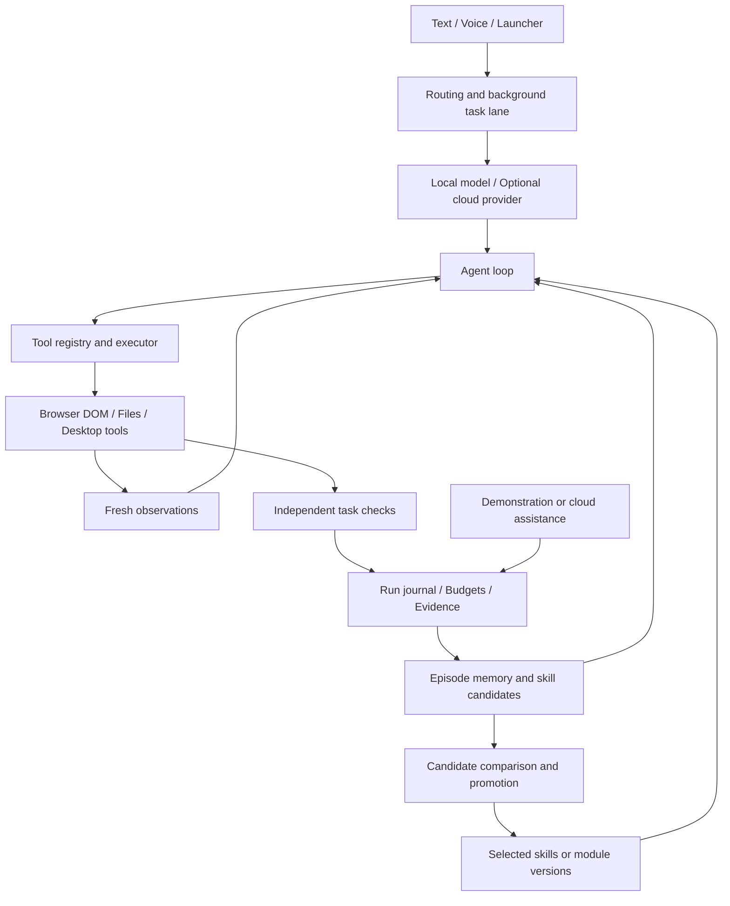

<div align="center">

# Kage (影)

### A learning computer agent for macOS

**Act on your computer. Learn from assistance. Evolve through verified experiments.**

[Roadmap](docs/agent-memory-evolution-master-plan-2026-09-29.md) · [Task queue](docs/plans/task-queue-2026-10-01.md) · [Experiment reports](docs/experiments/README.md) · [Issues](https://github.com/lemon5227/Kage/issues)

</div>

Kage is building toward a general-purpose computer agent that combines local execution, affordable cloud assistance, reusable memory and skills, and controlled self-modification. Its goal is to handle everyday work across browsers, files, and native apps—and improve from verified experience rather than repeat the same mistakes.

The project started as a local desktop assistant with voice and Live2D. It is growing into an agent runtime and experimental platform for **computer use and self-evolution**, designed around modest hardware: an Apple Silicon Mac with 16 GB of memory and optional cloud APIs.

**Current status: active experimental development.** Controlled browser and file workflows are implemented and tested. Arbitrary websites, broad native-app automation, continuous autonomous evolution, and human-level general ability remain goals. The roadmap describes intended capabilities; the reports describe what actually ran.

## What Kage is building

- **Computer use:** observe the environment, plan, execute tools, recover from errors, and verify the resulting state. Browser DOM is the first structured interface; macOS accessibility and cross-app workflows come next.
- **Local + cloud collaboration:** use a small local model for affordable execution and call a cloud teacher when assistance is needed. Preserve the teacher's actual actions and verified outcome for later reuse.
- **Learning from demonstrations:** capture actions and corrections, turn verified episodes into editable skills, and test those skills on different inputs. A dedicated browser teaching UI is available for controlled forms.
- **Memory that supports action:** retain episodes, provenance, versioned candidates, and evidence; retrieve useful experience and procedural skills instead of treating all history as chat text.
- **Self-evolution:** experiment with changes to skills and selected agent modules, compare candidates using independent checks, and retain or reject changes based on measured results.

Learning has distinct layers: **experience memory → reusable skills → agent-module changes → eventual model distillation**. Saving a trajectory is not weight training, and a successful tool call is not proof that a task is complete.

## Available today

| Area | Implemented and observed | Current boundary |
|---|---|---|
| Agent runtime | Multi-step model/tool/observation loop, structured tool contracts, local/cloud provider routing, background jobs and cancellation | Broad task reliability is still under development |
| Desktop assistant | System commands, file tools, optional speech input/output, Tauri and Live2D interface | These features do not establish general GUI competence |
| Browser execution | DOM observations, semantic actions, stale-reference recovery, bounded workflows, actual save/readback checks | Controlled task environments; arbitrary logged-in websites are not yet supported |
| Task and teaching UI | Launcher/API task states, budgets and artifacts; browser recording, corrections, editable parameters and fresh-page replay | Teaching supports single forms with text fields, checkboxes and a save button; actual human acceptance remains pending |
| Experience and skills | Hash-bound episodes, filtered generation feedback, candidate digests, real local/cloud skill execution | Browser generalization gains remain unproven; candidates are not automatically installed |
| Module evolution | A recovery-module self-modification pilot with actual candidate code loading and independent evaluation | Selected experimental module; not ongoing autonomous rewriting of the daily runtime |

The validated local setup uses **Agents-A1-4B Q4_K_M with llama.cpp**. Cloud teaching experiments have used DeepSeek. Backends are configurable; model choice alone does not determine task success.

## Architecture



The action loop and experiment loop share execution and evidence infrastructure. Browser workflows resolve semantic targets on the current page; they do not replay old element IDs or coordinates. Independent checks inspect actual saved state where a reliable checker exists. Tasks without one remain **unknown**, rather than being labeled successful because the agent stopped.

Skill execution, cloud takeover, source modification and weight training are reported separately. Promotion requires the applicable comparison to pass; an unpromoted skill can be explicitly tested without becoming a default capability.

## Try the browser teaching flow

Prerequisites: Apple Silicon macOS, Python 3.10+, Node.js 18+, and installed Chromium for Playwright. The latest verified Python environment is 3.13.11. Native Tauri development also needs its Rust/build tooling; the browser Launcher below can be used separately.

```sh
git clone https://github.com/lemon5227/Kage.git
cd Kage
python3 -m venv .venv
source .venv/bin/activate
python -m pip install -r requirements.txt -r requirements-computer-use.txt
python -m playwright install chromium
```

The full dependency set includes optional audio/model packages; microphone support may require PortAudio on macOS.

Start the control API:

```sh
KAGE_MODE=control KAGE_BROWSER_PYTHON="$PWD/.venv/bin/python" \
  python -m uvicorn core.server:app --host 127.0.0.1 --port 12345
```

In another terminal, from the repository root:

```sh
cd kage-avatar
npm install
npm run dev
```

Open **http://localhost:1420/launcher.html** and find **浏览器教学**:

1. Choose a teaching task and the human-declared source, then start.
2. Wait until the dedicated browser is ready. Follow the visible goal, correct any mistakes, and save.
3. Finish the demonstration to run the independent check and extract a candidate.
4. Choose the new-input task, edit the JSON parameters to match its goal, and replay on a fresh page.

Recording and direct workflow replay need **no model server or cloud key**. The executor is labeled `workflow_engine`; this proves the capture/reuse path, not that a model has learned it. The separate model-consumption experiment records whether the local model actually calls the skill.

Teaching evidence defaults to `~/.kage/browser-demonstrations`; override it with `KAGE_BROWSER_DEMONSTRATIONS_DIR`. `KAGE_BROWSER_PYTHON` selects the browser-capable interpreter. The dedicated human browser is visible; automation captures are labeled separately.

For the full voice/desktop runtime, activate the environment and run `python main.py`; the native frontend can be started with `npm run tauri dev` from `kage-avatar`. Model, audio assets and macOS permissions must be configured for the chosen runtime. Do not assume the browser teaching flow configures all of them.

## Models and cloud configuration

Runtime settings are read from `~/.kage/config.json`. Local inference uses `model.local_runtime`; cloud settings use `model.cloud_api`, with optional `model.hybrid` routing. Start a compatible local server and configure its model name/host/port, or configure your chosen cloud provider. Keep API credentials outside the repository.

Cloud-assisted task learning is an explicit experimental chain. Existing runtime fallback settings are not evidence that every failed computer task automatically becomes a verified learning episode. Optional speech and cloud features may contact external services; local execution does not imply every feature is offline.

## Evidence and development

The latest browser teaching package passed **992 engineering tests** and verified two captures plus two fresh-input workflow replays. Its local 4B model completed both pilot tasks, but made **zero calls to the new skills**. The capture/reuse path works; automatic skill adoption and a learning advantage remain unproven. See the [full report](docs/experiments/2026-10-07-browser-demonstration.md).

The project records successes **and failures**, including model attempts, actual actions, saved-state checks, tokens, time, candidate versions and provenance. Engineering tests, real-model pilots, new-input transfer and held-out comparisons are separate levels of evidence.

- [Current experiment index](docs/experiments/README.md)
- [Browser task entry](docs/experiments/2026-10-04-browser-task-entry.md)
- [Browser teaching and reuse](docs/experiments/2026-10-07-browser-demonstration.md)
- [Browser transfer experiment, including negative results](docs/experiments/2026-10-03-browser-transfer.md)
- [File skill transfer comparison](docs/experiments/2026-10-01-c4-transfer-ablation.md)
- [Recovery-module self-modification](docs/experiments/2026-10-01-e3-recovery-self-modification.md)

Run engineering checks in an environment with the test dependencies and Playwright installed:

```sh
python -m pip install pytest pytest-asyncio httpx
python -m pytest tests -q
cd kage-avatar
npm run build
```

Most browser integration tests operate real owned Chromium pages and inspect HTTP saves/readback. Scripted actions are engineering evidence, not human demonstrations or AI benchmark scores. Raw experiment artifacts stay outside Git by default; reports identify their locations and hashes. Reproducing model pilots also requires the matching weights, runtime settings and evidence.

## Next milestones

1. Complete actual human browser teaching acceptance; extend native macOS accessibility execution and reliable document save/readback.
2. Add native demonstrations and browser/native cross-app task families with independent checks.
3. Expand candidate lineage, compatibility and memory selection; evolve additional agent modules and evaluate failure-conditioned evolution routing.
4. Surface version changes, scores and costs; broaden held-out experiments and research reports.
5. Train small distillation adapters when verified, diverse trajectories and GPU/export support justify it. Evaluate visual grounding and inference engines against measured bottlenecks.

The complete E/C task queue and execution order live in the [roadmap](docs/agent-memory-evolution-master-plan-2026-09-29.md) and [handoff](docs/plans/execution-handoff-2026-10-03.md). Kage aims to become a capable, adaptable computer agent; each stage must earn that claim through working behavior and reproducible evidence.

## License

MIT. Historical routing and interface notes are retained in [the optimization history](docs/optimization_history.md).
