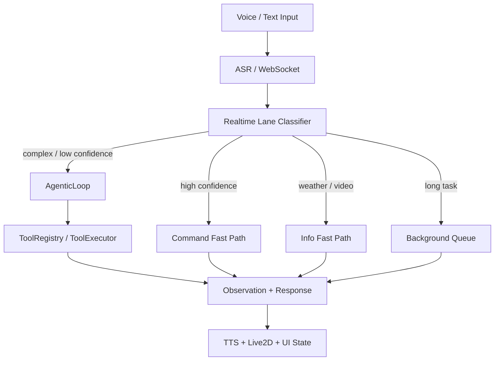

<div align="center">

# Kage (影)
### Local LLM Agent Runtime for macOS
#### Route-based desktop automation with local inference, tools, ASR/TTS, and Live2D

[🌐 官方网站](https://kage.lemony.eu.org) | [📖 文档](https://github.com/lemon5227/Kage) | [🐛 报告问题](https://github.com/lemon5227/Kage/issues)

---

**Kage** is a local LLM Agent Runtime that turns voice/text input into controllable desktop actions.
It combines local model inference, route-based task classification, structured tool execution,
dialog state, safety confirmation, ASR/TTS, and a Tauri + Live2D interface.

Unlike a pure chatbot, Kage separates deterministic commands from general agent work:

- **Command fast path** for low-latency system controls such as volume, brightness, Wi-Fi, Bluetooth, screenshots, and app launch.
- **Weather/video fast paths** for common information workflows where template responses and deterministic fallbacks reduce empty turns.
- **Background lane** for long-running file organization, summarization, and multi-step tasks.
- **AgenticLoop** for complex tool-using workflows with model -> tool -> observation -> response iterations.
- **Pending action state** for confirmation, cancellation, follow-up, and correction flows.

</div>

## System At A Glance



## Engineering Focus

- **Routing over prompt sprawl**: route + confidence decides whether a request should execute directly, ask for confirmation, or enter the general agent loop.
- **Structured tools**: ToolRegistry defines capability boundaries; ToolExecutor normalizes calls, executes handlers, records logs, and gates risky actions.
- **Stateful desktop UX**: pending confirmation and follow-up state handles real user turns such as "confirm", "cancel", "open this", and "not this one".
- **Local-first privacy**: the model, speech stack, memory, and desktop control path run on the user's Mac by default.
- **Eval-ready runtime**: benchmark work tracks route accuracy, latency, fallback rate, empty response rate, and tool success rate.

Interview and evaluation docs:

- [docs/INTERVIEW_DEEP_DIVE.md](docs/INTERVIEW_DEEP_DIVE.md)
- [docs/BENCHMARK_PLAN.md](docs/BENCHMARK_PLAN.md)
- [eval/eval_cases.json](eval/eval_cases.json)

## ✨ 核心特性 (Features)

### 🚀 极速响应 (Zero Latency)
告别等待。Kage 采用独创的三层思考架构：
- **<1ms** 意图识别：瞬间听懂你的指令。
- **<500ms** 快速操作：调整音量、截图、看时间，比你动手还快。
- **1.4s** 深度思考：处理复杂任务也无需久等。

### 💖 鲜活个性 (Vivid Persona)
Kage 拒绝冷冰冰的机器回复。
- **傲娇人设**：她会撒娇，会吐槽，也会在你工作时默默陪伴。
- **沉浸体验**：所有快速命令都注入了灵魂回复 ("咔嚓！截图好啦💖")。
- **Live2D 形象**：基于 Haru 模型，表情丰富，动作灵动，支持口型同步 (LipSync)。

### 🔒 隐私优先 (Privacy First)
- **完全本地化**：基于 Qwen3 GGUF + llama-server，本地推理无需联网。
- **数据安全**：你的对话、记忆、屏幕截图永远只留在你的 Mac 上。

### �️ 强大能力 (Powerful Skills)
- **系统掌控**：原生级控制音量、亮度、媒体播放、Wi-Fi/蓝牙。
- **效率工具**：剪贴板管理、文件操作、天气/汇率查询。
- **无限扩展**：内置 Python 解释器，Kage 可以通过编写 `skills` 脚本自我进化。

---

## 📥 快速开始 (Get Started)

### 环境要求
- **硬件**: Mac with Apple Silicon (M1/M2/M3/M4)
- **系统**: macOS 14.0+
- **环境**: Python 3.10+, Node.js 18+

### 安装运行

**1. 启动大脑 (Backend)**
```bash
# 建议使用 Conda 创建干净环境
conda create -n kage python=3.10
conda activate kage

# 安装依赖
pip install -r requirements.txt

# 启动 (首次运行会自动下载模型)
python main.py
```

**2. 唤醒躯体 (Frontend)**
```bash
cd kage-avatar
npm run tauri dev
```

现在，试着对她说："Hey Kage, 帮我截个图！" ✨

---

## 🏗️ 技术架构

Kage 是 AI Agent 技术的集大成者：
*   **Brain**: Qwen3 GGUF + llama-server (OpenAI Compatible API)
*   **Ears**: FunASR (Paraformer + Emotion2Vec) + **Vosk** (超低功耗唤醒)
*   **Body**: Tauri v2 + PixiJS Live2D
*   **Control**: Quartz Event Services + Native macOS APIs

## 📄 License

MIT License © 2026 Kage Project
---
> 📜 **历史技术文档**: 查看 [docs/optimization_history.md](docs/optimization_history.md) 了解 Kage 从 v1.0 CoT 到 v3.0 双层路由的技术演进。
>
> 🧭 **接手与优化入口**:
> - [docs/HANDOFF_FOR_NEXT_MODEL.md](docs/HANDOFF_FOR_NEXT_MODEL.md)
> - [docs/agent_orchestration_playbook.md](docs/agent_orchestration_playbook.md)
> - [docs/agent_progress_log.md](docs/agent_progress_log.md)
